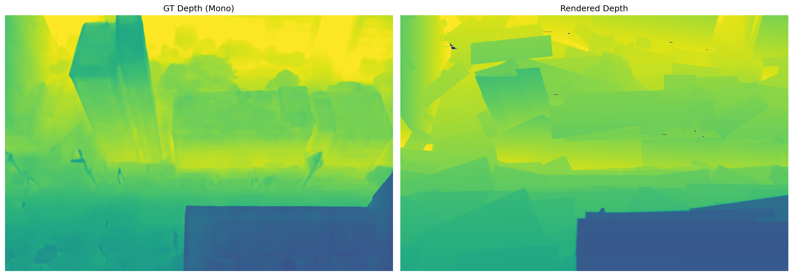
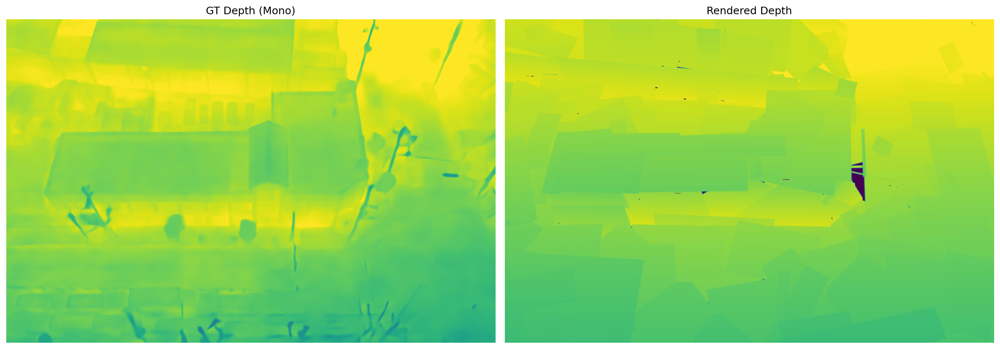
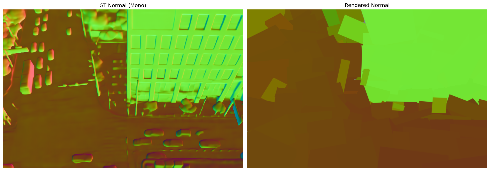
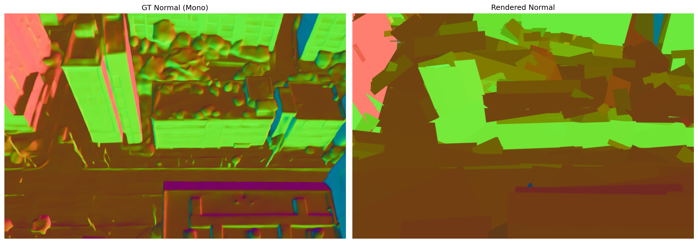
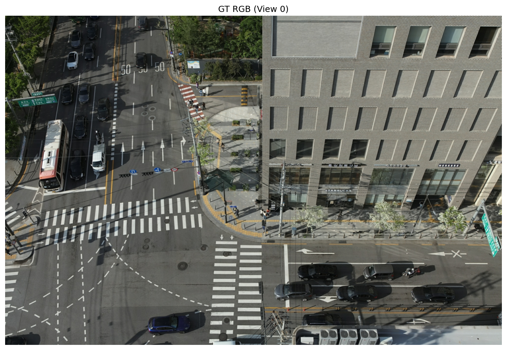
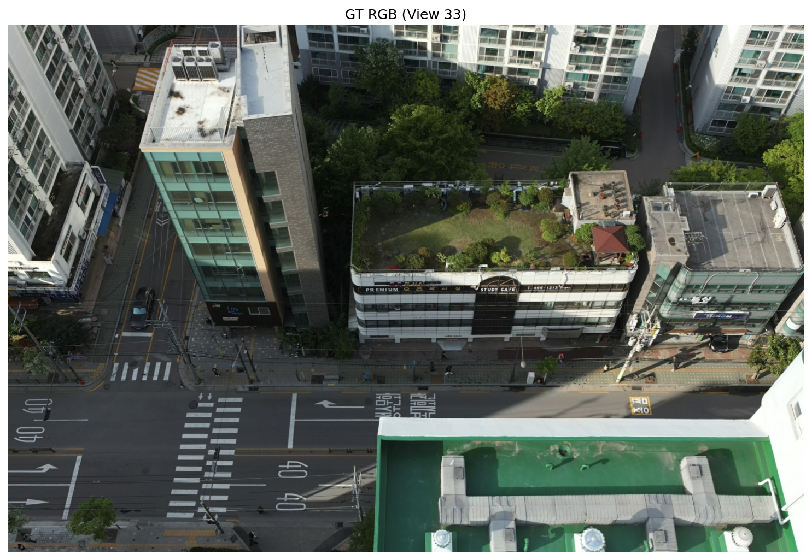

# Phase 0: SfM/MVS 입력 확보 결과 보고

## 수행 일시
2026-02-16

## 수행 작업 요약
COLMAP 출력(성수동 드론 이미지)을 PlanarSplatting 입력 형식으로 변환하는 `scripts/colmap_to_ps.py`를 작성하고, 변환된 데이터로 5000 iteration 학습을 수행하여 baseline 결과를 확보하였다.

### 수행 단계
1. **COLMAP 데이터 분석**: `dense/sparse/` (undistorted PINHOLE) + `dense/images/` 180장 확인
2. **`scripts/colmap_to_ps.py` 작성**: COLMAP binary → PlanarSplatting data dict 변환
   - 카메라 모델 자동 감지 (PINHOLE, SIMPLE_RADIAL, OPENCV 등)
   - 불균일 해상도 자동 처리 (2068~2073 x 1370~1371 → 2068 x 1370 통일)
   - Metric3D ViT-Large로 mono depth/normal 추출
   - COLMAP sparse points 기반 scale alignment (180/180 성공)
   - `--init_method colmap/vggt` 플래그 지원
   - `--run_training` 으로 학습까지 일괄 실행 가능
3. **학습**: 100 views, 3000 초기 planes, 5000 iters
4. **평가 및 시각화**: evaluate.py, visualize_primitives.py, render_views.py

### 입력 데이터 요약
| 항목 | 값 |
|------|-----|
| 이미지 | 180장 (DJI 드론, 성수동) |
| 사용 이미지 | 100장 (메모리 제약) |
| 원본 해상도 | 2048 x 1365 |
| 학습 해상도 | 1370 x 2068 (undistorted) |
| COLMAP sparse points | 143,696개 |
| 카메라 모델 | PINHOLE (undistorted) |

## 정량 지표
| 지표 | 값 | 비고 |
|------|-----|------|
| Depth MAE | 0.0672 +/- 0.0513 | Metric3D mono depth 대비 |
| Normal cos | 0.9107 +/- 0.0197 | Metric3D mono normal 대비 |
| PSNR | N/A | 색상이 random이므로 무의미 |
| Final planes | 2,123 (초기 2,743 → 최종 2,123) | |
| Total loss | 1.94 → 0.27 (86% 감소) | |
| Depth loss | 0.133 → 0.048 | |
| Normal L1 | 0.666 → 0.261 | |
| Normal cos loss | 0.171 → 0.060 | |

### Loss 수렴 추이
| Iter | Planes | Depth Loss | Normal L1 | Normal Cos | Total Loss | Trend |
|------|--------|-----------|-----------|-----------|-----------|-------|
| 0 | 2,743 | 0.1330 | 0.6664 | 0.1707 | 1.9401 | stable |
| 1,000 | 2,716 | 0.0794 | 0.2704 | 0.0601 | 0.6711 | -65.4% |
| 2,000 | 2,621 | 0.0537 | 0.2566 | 0.0598 | 0.4961 | -74.4% |
| 3,000 | 2,409 | 0.0486 | 0.2616 | 0.0608 | 0.4072 | -79.0% |
| 4,000 | 2,286 | 0.0481 | 0.2625 | 0.0607 | 0.3337 | -82.8% |
| 5,000 | 2,187 | 0.0479 | 0.2612 | 0.0602 | 0.2720 | -86.0% |

## 정성적 결과

### 렌더링 결과

### 3D 시각화
- PLY export: `planarSplat_ExpRes/seongsu_phase0/primitives_normal.ply` (normal 기반 색상)
- COLMAP sparse: `planarSplat_ExpRes/seongsu_phase0/colmap_sparse.ply` (143,696 points)
- Planar mesh: `planarSplat_ExpRes/seongsu_phase0/seongsu_colmap_example/2026_02_16_08_26_39/example/example_planar_mesh.ply`

## Go/No-Go 판단
- [x] Go / [ ] Retry / [ ] Switch
- **정합 이미지**: 180장 전체 정합 (>= 100장 Go 기준 충족)
- **건물 형태**: Depth/Normal 렌더링에서 건물 구조 식별 가능
- **Loss 수렴**: 모든 loss가 일관되게 감소 (-86% 총 감소)
- **Normal 품질**: cos similarity 0.91 — 벽면/지붕 방향이 잘 학습됨

## 이슈 및 해결
1. **메모리 제약**: 180장 전체 사용 시 `torch.save`에서 OOM 발생 (이미지+depth+normal ~10GB)
   - 해결: 100장으로 제한하여 학습. 향후 전체 사용 시 분할 저장 또는 lazy loading 필요
2. **불균일 해상도**: COLMAP undistortion 후 이미지마다 1~5px 차이
   - 해결: `compute_target_resolution()`으로 최소 해상도로 통일 리사이즈
3. **모듈 경로**: `planarsplat/utils/`가 Python path에 없는 문제
   - 해결: `sys.path.insert(0, planarsplat)` 추가
4. **evaluate.py input_data.pth 검색**: 실험 디렉토리 4단계까지만 탐색
   - 해결: input_data.pth를 실험 디렉토리에 symlink

## 생성/수정 파일
- `scripts/colmap_to_ps.py` — COLMAP → PlanarSplatting 변환 + 학습 스크립트 (신규)
- `scripts/render_views.py` — 렌더링 결과 이미지 저장 스크립트 (신규)

## 다음 Phase
- **Phase 1**: MVS Depth Supervision 교체
  - COLMAP `dense/stereo/depth_maps/` MVS depth가 이미 생성되어 있음
  - Metric3D mono depth → MVS depth로 교체하여 기하 정확도 향상 기대
