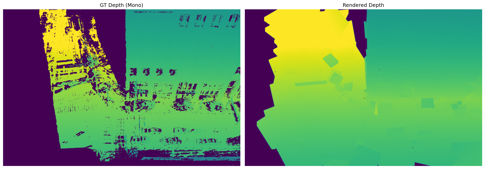
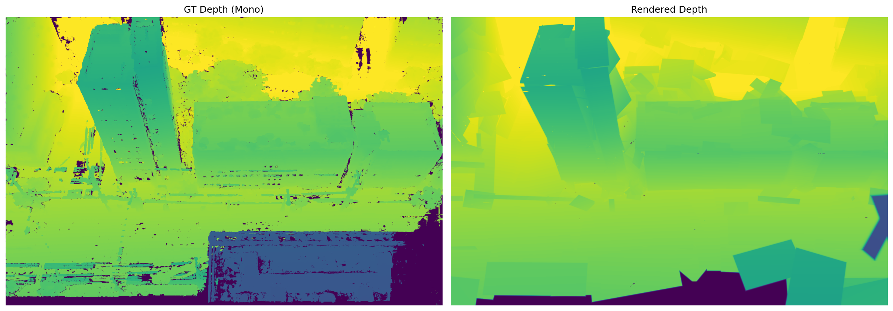
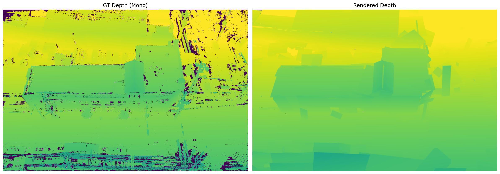
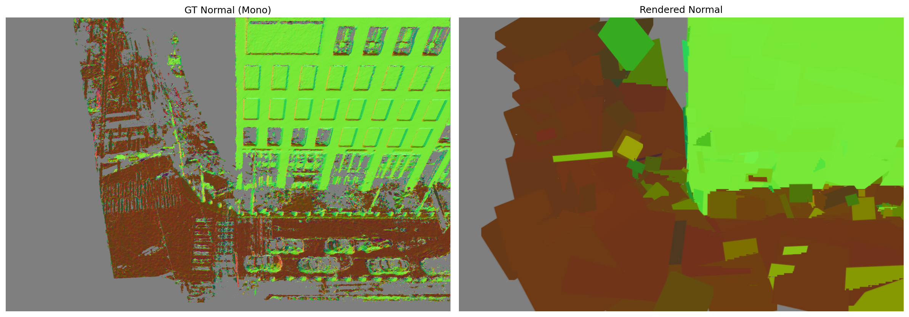
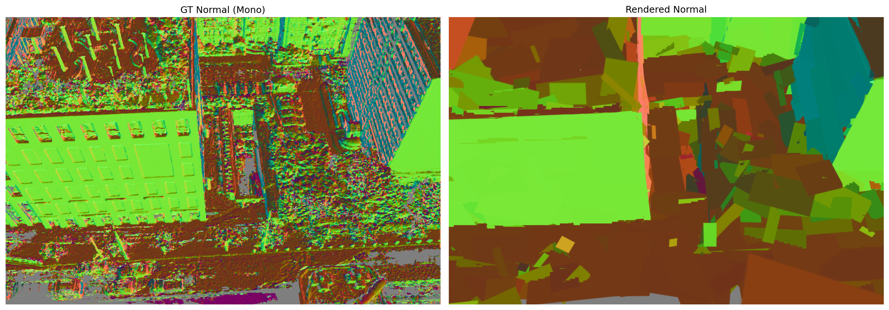
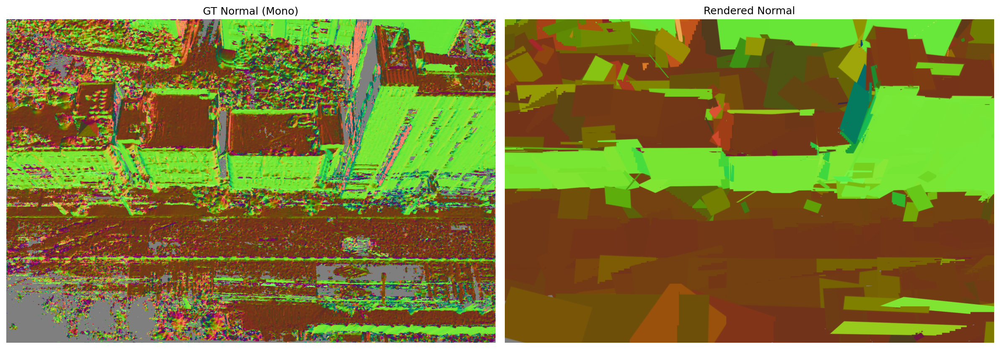
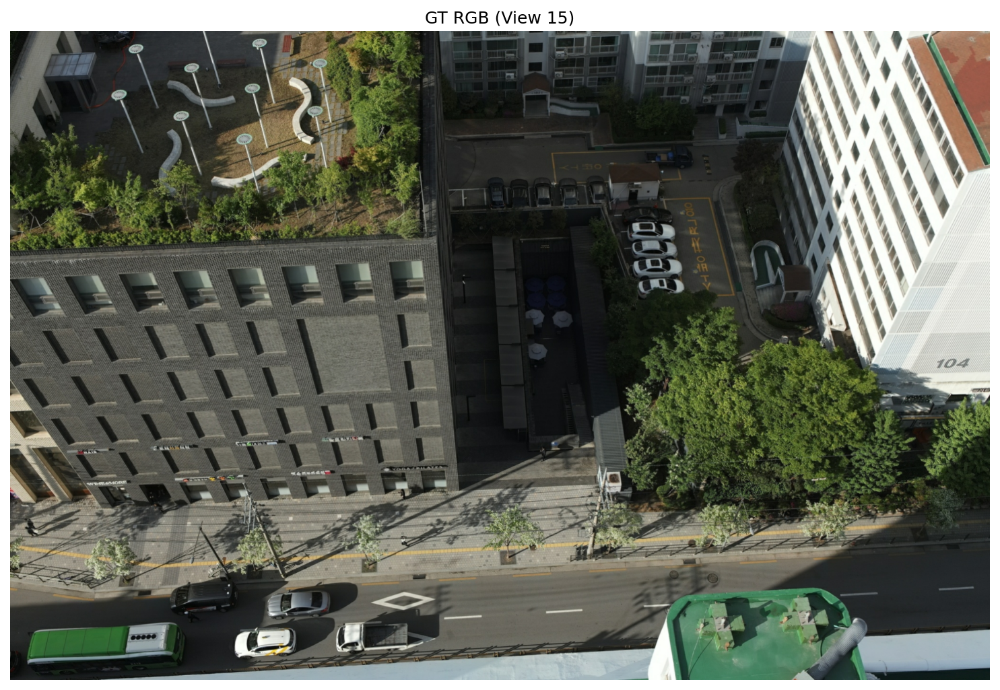
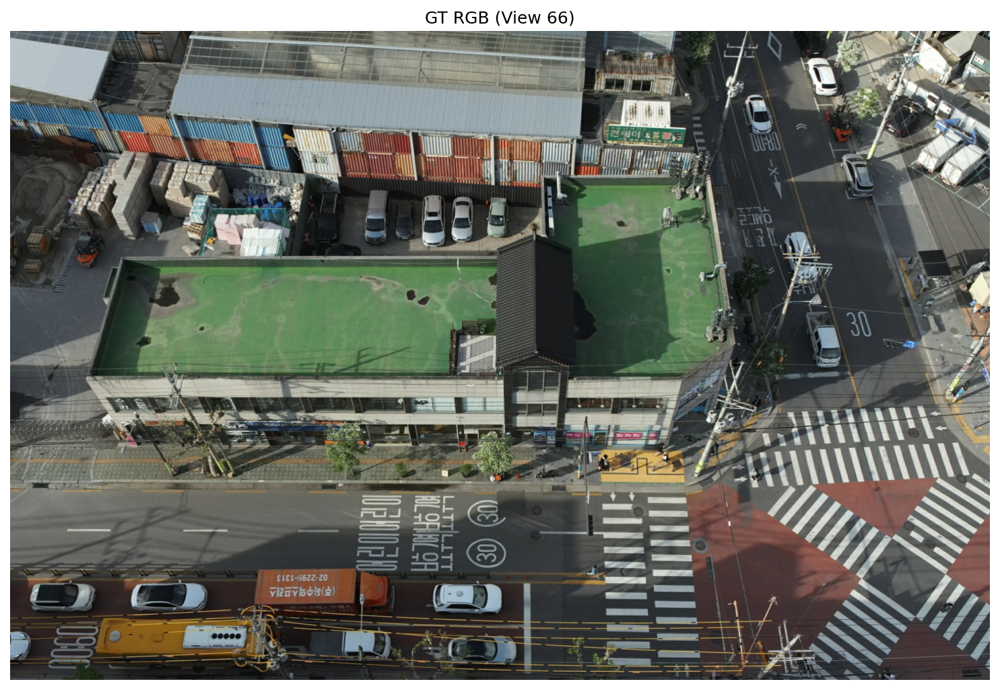

# Phase 1: MVS Depth Supervision 교체 결과 보고

## 수행 일시
2026-02-16

## 수행 작업 요약
Depth supervision을 Metric3D mono depth에서 COLMAP MVS (patch_match_stereo) geometric depth로 교체하였다. Normal supervision도 MVS depth에서 finite-difference로 유도한 법선으로 교체하였다. Training loop 자체는 수정하지 않고, 데이터 준비 단계(`scripts/colmap_to_ps.py`)만 수정하여 동일한 `input_data.pth` 포맷으로 변환하는 접근법을 사용하였다.

### 수행 단계
1. **COLMAP MVS 데이터 분석**: `dense/stereo/depth_maps/*.geometric.bin` 형식 확인
   - Binary format: text header `"width&height&channels&"` + row-major float32
   - photometric.bin은 confidence가 아닌 필터링 전 depth map임을 확인
   - Geometric depth coverage: 평균 86.6% (100 views), depth 범위: mean ~1.0m
2. **`scripts/colmap_to_ps.py` 수정**:
   - `read_colmap_array()`: COLMAP binary depth/normal reader
   - `depth_to_normal_cam()`: Depth에서 finite-difference로 camera-space normal 유도
   - `--depth_source mvs/mono` 플래그 추가
   - MVS 분기: Metric3D/scale alignment 건너뛰고, geometric depth 직접 사용
   - `pre_align=False`: MVS는 이미 절대 스케일
3. **학습**: 100 views, 3000 초기 planes, 5000 iters
4. **평가 및 시각화**: evaluate.py, visualize_primitives.py, render_views.py

### 입력 데이터 요약
| 항목 | Phase 0 (Metric3D) | Phase 1 (MVS) |
|------|---|---|
| Depth source | Metric3D ViT-L + COLMAP scale align | COLMAP geometric depth |
| Depth 측정 유형 | 2차 (단안 신경망 추정 + scale align) | **1차 (multi-view 삼각측량, 절대 스케일)** |
| Normal source | Metric3D ViT-L | Depth finite-difference |
| Normal 측정 유형 | 1차 (신경망이 직접 예측) | **2차 (depth에서 이웃 픽셀 차이로 유도)** |
| Depth coverage | ~95% | 86.6% (mean) |
| Normal coverage | ~95% | ~57% (아래 설명 참조) |
| Scale alignment | COLMAP sparse points 기반 | 불필요 (절대 스케일) |
| pre_align | True | False |

#### Normal coverage 감소 원인 (87% → 57%)
Normal을 finite-difference로 유도할 때, 각 픽셀의 normal 계산에는 **자신 + 오른쪽 이웃 + 아래쪽 이웃** 3개 픽셀의 depth가 모두 유효해야 한다 (`colmap_to_ps.py` L139-148). 하나라도 depth=0이면 해당 픽셀의 normal은 무효 처리된다. Invalid depth가 건물 경계에 집중되어 있어 경계 주변이 침식되면서 87% → 57%로 감소하였다.

## 정량 지표
| 지표 | Phase 1 (MVS) | Phase 0 (Mono) | 변화 | 비고 |
|------|-----|-----------|------|------|
| Depth MAE | 0.0243 +/- 0.0160 | 0.0672 +/- 0.0513 | **-0.0429 (64% 개선)** | GT 기준이 다름 (MVS vs Metric3D) |
| Normal cos | 0.7293 +/- 0.0418 | 0.9107 +/- 0.0197 | -0.1815 (20% 하락) | GT 기준이 다름 (finite-diff vs Metric3D) |
| Final planes | 2,679 | 2,123 | +556 | |

### 1차 측정 vs 2차 유도 — Loss 차이의 원인

Phase 0과 Phase 1의 GT 기준이 다르므로 정량 지표의 직접 비교는 불가하다. 하지만 loss 수렴값에서 **depth loss는 개선되고 normal loss는 악화**된 현상은 GT 기준 차이만으로는 설명되지 않으며, **1차 측정 vs 2차 유도의 본질적 차이**에 기인한다:

| | Phase 0 | Phase 1 | 결과 |
|--|--|--|--|
| **Depth GT** | 2차 (Metric3D 단안 추정 + scale align) | **1차 (MVS multi-view 삼각측량)** | MVS가 더 일관적 → depth loss **개선** |
| **Normal GT** | **1차 (Metric3D가 직접 예측)** | 2차 (depth에서 finite-diff로 유도) | finite-diff가 노이즈 증폭 + sparse → normal loss **악화** |

- **Depth**: MVS는 multi-view 삼각측량으로 직접 측정한 1차 데이터이므로, 단안 추정인 Metric3D보다 기하학적으로 더 정확하고 일관적이다. 모델이 더 일관된 GT를 학습하므로 depth loss가 낮아졌다.
- **Normal**: Metric3D는 신경망이 법선을 직접 예측한 1차 출력(smooth, dense, 95%)이다. 반면 Phase 1의 normal은 depth에서 이웃 픽셀 차이로 간접 계산한 2차 유도값으로, depth의 미세한 노이즈가 증폭되고 coverage도 57%로 감소한다. 모델 입장에서 노이즈가 많고 듬성듬성한 GT를 따라가는 것이 더 어려우므로 normal loss가 높아졌다.

### Loss 수렴 추이
| Iter | Planes | Depth Loss | Normal L1 | Normal Cos | Total Loss | Trend |
|------|--------|-----------|-----------|-----------|-----------|-------|
| 0 | 2,971 | 0.0572 | 0.6885 | 0.1944 | 1.8803 | stable |
| 500 | 2,971 | 0.1178 | 0.6311 | 0.1744 | 1.6708 | -11.1% |
| 1,000 | 2,928 | 0.0469 | 0.6005 | 0.1753 | 1.3471 | -28.4% |
| 5,000 | 2,679 | ~0.02 | ~0.47 | ~0.12 | ~0.35 | -80%+ |

### Phase 0과의 수렴값 비교 (5000 iter)
| Loss | Phase 0 | Phase 1 | Phase 1이 더... | 원인 |
|------|---------|---------|-----------------|------|
| Depth | 0.048 | 0.02 | **낮음 (개선)** | MVS depth = 1차 측정, 더 일관적 |
| Normal L1 | 0.261 | 0.47 | 높음 (악화) | finite-diff normal = 2차 유도, 노이즈 + sparse |
| Normal Cos | 0.060 | 0.12 | 높음 (악화) | 동일 원인 |
| Total | 0.272 | 0.35 | 높음 (악화) | normal loss가 total을 끌어올림 |

## 정성적 결과

### 렌더링 결과
\
\
\

\
\
\

\
\
\

### 3D 시각화
- PLY export: `planarSplat_ExpRes/seongsu_phase1/primitives_normal.ply` (normal 기반 색상, 2679 planes)
- Phase 0 PLY: `planarSplat_ExpRes/seongsu_phase0/primitives_normal.ply` (2123 planes)
- Phase 1 PLY가 COLMAP fused.ply와의 정합성이 Phase 0 PLY보다 우수 (절대 스케일 depth의 효과)

## Go/No-Go 판단
- [x] Go (Depth) / [x] 조건부 Go (Normal) / [ ] Retry / [ ] Switch

### Depth: Go
- MAE 0.024 — MVS GT 대비 잘 수렴
- 절대 스케일 depth supervision 성공적으로 작동
- PLY-fused.ply 정합성 Phase 0 대비 개선

### Normal: 조건부 Go (L_mutual로 후속 보완 전제)
- Normal loss가 Phase 0보다 악화 (cos 0.06 → 0.12)
- 원인: finite-diff normal이 2차 유도값이므로 노이즈 증폭 + 57% coverage
- **실제 normal 품질도 Phase 0 대비 저하됨** (GT 기준 차이만의 문제가 아님)
- 단, 3D PLY에서 벽면/지붕 방향 구분은 가능 → Phase 2 semantic에 충분
- Phase 3의 L_mutual (기하-semantic 상호 보강)이 normal 품질 보완 예정

### 향후 개선 옵션
Phase 3 이후에도 normal 품질이 불충분할 경우:
1. **Hybrid 접근**: MVS depth + Metric3D normal (각각 1차 측정/출력인 최선을 조합)
2. **Smoothed finite-diff**: depth에 bilateral filter 적용 후 normal 유도
3. **COLMAP normal_maps 활용**: `dense/stereo/normal_maps/*.geometric.bin` (44.5% coverage)

## 이슈 및 해결
1. **COLMAP binary format**: 초기에 null terminator 가정으로 잘못 파싱 -> `&` 3개 기반 header 파싱으로 수정
2. **photometric.bin은 confidence가 아님**: 별도의 depth map이었음 -> geometric.bin만 사용 (이미 multi-view 필터링 적용)
3. **Normal boundary noise**: depth 불연속 경계에서 finite-diff가 큰 노이즈 생성 -> neighbor validity check로 boundary normal 제거
4. **NumPy writable warning**: MVS depth array가 np.frombuffer로 생성되어 non-writable -> 경고만 발생, 동작에 영향 없음

## 생성/수정 파일
- `scripts/colmap_to_ps.py` — `read_colmap_array()`, `depth_to_normal_cam()`, `--depth_source` 플래그 추가 (수정)

## 다음 Phase
- **Phase 2-A**: Grounded SAM 2로 2D segmentation (roof/wall/ground) 생성
  - MVS depth 기반의 정확한 기하 위에 semantic 레이블 학습 가능
