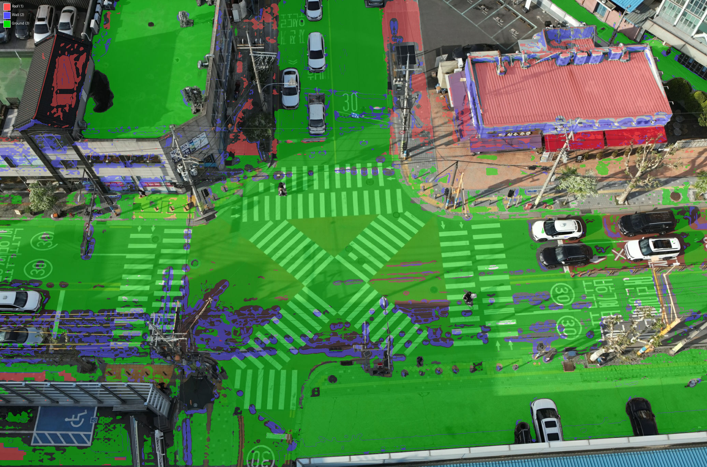

# Phase 2-A: 2D Segmentation 생성 결과 보고

## 수행 일시
2026-02-20 (최종 업데이트: v10 ambiguous-as-background)

## 수행 작업 요약
Grounded SAM 2 (Grounding DINO + SAM 2.1)를 사용하여 드론 항공 이미지에서 roof/wall/ground semantic segmentation map을 생성했다. **MVS Hybrid 접근법** 적용: Grounded SAM으로 building/ground 영역을 검출한 후, **depth-derived normals** + DJI gimbal pitch + **height-based classification**으로 building 영역을 roof/wall로 분류한다.

### 최종 구현: v10 (Confident Labels Only + Ambiguous as Background)
- COLMAP world frame을 사용하지 않고, **camera frame에서 직접** gravity 방향을 계산
- DJI EXIF `GimbalPitchDegree` → `gravity_up_cam = [0, -cos(pitch), sin(pitch)]`
- **Normal source: Smoothed MVS depth → 3D unprojection → finite-diff normals (camera frame)**
- **Height-based classification**: depth → 3D unprojection → world Y coordinate → ground level(Y_ref) 기준 roof/ground 분류
- **Ambiguous normals (0.3 < |dot| ≤ 0.85) → background**: 불확실한 분류를 강제하지 않고, L_mutual geometric prior에 위임

### 핵심 설계 원칙: Confident Labels Only
v10의 핵심 원칙은 **확실한 분류만 라벨링하고, 불확실한 픽셀은 L_mutual에 위임**하는 것이다.

**Multi-view consistency trap 방지:**
ambiguous normal(0.3 < |dot| ≤ 0.85)을 wall로 강제 분류하면, 모든 view에서 일관적으로 잘못된 라벨이 생긴다. 예: 경사 지붕(30° 경사)이 모든 view에서 wall로 분류됨 → L_sem이 잘못된 방향으로 일관되게 강화 → L_mutual도 이를 바로잡을 수 없음 (multi-view에서 "correct signal" 자체가 없으므로).

해결: ambiguous 픽셀을 background(0)으로 남김 → `ignore_index=0`으로 L_sem supervision에서 제외 → L_mutual의 geometric prior(L_slope)가 기하학적으로 올바른 분류를 유도.

### v8 → v10 진화 과정
| 버전 | 접근 | 문제 |
|------|------|------|
| v8 | Ambiguous → zone-dependent default (building→wall) | 경사 지붕 multi-view 일관적 오분류 |
| v9 | Ambiguous → height tiebreaker (elevated→roof) | Depth discontinuity에서 facade artifact |
| **v10** | **Ambiguous → background (no label)** | **Confident labels only** |

### MVS PatchMatch Normal → Depth-Derived Normal 전환 이유
MVS PatchMatch normals는 텍스처 없는 외벽에서 카메라 Z축 방향으로 **퇴화**한다.
- 퇴화 법선의 |dot(normal, gravity)| ≈ |sin(pitch)| ≈ 0.755 (pitch=-49°)
- 이 값이 roof(>0.85)도 wall(≤0.3)도 아닌 ambiguous zone에 위치
- 결과: **facade 전체가 uniform한 |dot|≈0.755** → roof/wall 구분 불가

반면 MVS depth는 multi-view 삼각측량으로 기하학적으로 검증됨:
- Depth를 smoothing → 3D point cloud unproject → finite-diff cross product
- **대규모 표면 방향을 정확히 캡쳐** (수직 wall → |dot|≈0, 수평 roof → |dot|≈1)

### Hybrid 전략 (v10)
1. Grounded SAM으로 "building"과 "ground" 영역을 독립 검출 (per-pixel score 저장)
2. **Score-based overlap resolution**: building∩ground 중첩 시 building_score > ground_score → building zone
3. **Depth-derived normals**: smoothed MVS depth → 3D → finite-diff → unit normals (camera frame)
4. **Height-based classification**: depth → c2w extrinsics로 world Y coordinate 계산 → Y_ref=0.308 기준 ground/elevated 판단
5. Building 영역 내에서 **|dot(normal_cam, gravity_up_cam)|** + height로 분류:
   - **Two-threshold + height system**:
     - |dot| > 0.85 (strong horizontal) + elevated → **roof**(1)
     - |dot| > 0.85 (strong horizontal) + ground level → **ground**(3)
     - |dot| ≤ 0.3 (strong vertical) → **wall**(2)
     - 0.3 < |dot| ≤ 0.85 (ambiguous) → **background**(0) — L_mutual에 위임
6. Ground-only zone: strong wall(|dot|≤0.3)만 wall override, 나머지는 ground
7. **Neighbor propagation**: depth 없는 building 픽셀 → 주변 라벨 majority vote (uniform_filter)
   - Ambiguous-normal 픽셀은 의도적으로 propagation 대상에서 제외
8. MVS depth/DJI pitch 없는 이미지 → text-only fallback

### Ambiguous Normal vs No-Depth: 차별적 처리의 근거

Building zone 내에서 라벨이 배정되지 않는 픽셀은 두 종류로 나뉘며, 각각 다른 논리로 처리한다.

| 상황 | 조건 | 처리 | 근거 |
|------|------|------|------|
| **Ambiguous normal** | depth 있음, 0.3 < \|dot\| ≤ 0.85 | **Background(0)** — L_sem 제외 | 기하 정보가 있으나 해석이 모호 |
| **No-depth** | MVS depth 없음 (textureless, specular) | **Neighbor propagation** | 기하 정보 자체가 부재 |

**Ambiguous normal → Background (라벨 배정 안 함):**
- 이 픽셀은 depth와 normal이 모두 존재하지만, 표면 방향이 수평(roof)도 수직(wall)도 아닌 중간 영역에 위치한다.
- 경사 지붕(~30° 경사)이 이 영역에 해당하는데, 이를 wall로 강제 분류하면 **모든 view에서 일관적으로 잘못된 라벨**이 생긴다.
- Multi-view consistency trap: 잘못된 라벨이 view 간에 일관적이면, L_sem이 잘못된 방향으로 강화하고, L_mutual도 "올바른 신호" 자체가 없어 교정이 불가하다.
- 따라서 `ignore_index=0`으로 L_sem supervision에서 제외하고, L_mutual의 geometric prior(L_slope)가 학습 중 기하학적으로 올바른 분류를 유도하도록 위임한다.
- **성능 미달 시 확인 포인트**: L_mutual이 ambiguous 영역에서 올바른 분류를 유도하지 못하면, threshold 조정(0.85↓, 0.3↑)으로 confident 영역을 넓히거나, multi-view voting으로 ambiguous 해소를 검토할 수 있다.

**No-depth → Neighbor propagation (주변 라벨로 채움):**
- MVS가 depth를 복원하지 못한 영역 (textureless facade, specular 반사, occlusion 경계 등).
- 기하 정보가 **아예 없으므로** "모호한 해석"이 아니라 "정보 부재"이다.
- 이런 영역은 대부분 facade 중간의 구조적 gap으로, 주변과 같은 클래스(wall)일 확률이 높다.
- 주변 31×31 윈도우에서 majority vote(uniform_filter)로 라벨을 결정하며, 주변에 라벨이 전혀 없는 경우에만 pitch 기반 fallback(pitch≤-60°→roof, else→wall)을 적용한다.
- 만약 no-depth도 background로 처리하면, facade 중간에 supervision 공백이 생겨 해당 primitive들이 L_sem을 전혀 받지 못하게 된다. 이는 "모호함"이 아니라 "정보 손실"이므로 주변 맥락으로 복원하는 것이 합리적이다.

**요약:** 기하 정보가 있지만 모호한 경우(ambiguous)와 기하 정보 자체가 없는 경우(no-depth)는 본질적으로 다른 문제이며, 전자는 "판단 보류(L_mutual 위임)", 후자는 "맥락 기반 복원(neighbor propagation)"이 각각 적절하다.

### 3-Class 직접 검출 비교 (기각)
GDINO로 "building roof"/"building facade"/"ground"를 각각 검출하는 방식 검증:
- 결과: roof 0%~53.5%로 이미지간 극심한 편차 (0619: facade 전체가 roof, wall=0%)
- 원인: GDINO가 oblique view에서 roof/facade를 시점별로 완전히 다르게 인식
- **이론적 근거**: roof vs wall은 표면 방향(기하학적 속성)이지 시각적 외관이 아님 → 기하 기반 2-step이 원리적으로 우월

### 클래스 매핑
| Class ID | 이름 | 검출 방법 | 색상 |
|----------|------|----------|------|
| 0 | background | 미분류 또는 ambiguous normal | 검정 |
| 1 | building roof | building zone + |dot|>0.85 + elevated | 빨강 |
| 2 | building wall | building zone + |dot|≤0.3, 또는 no-depth neighbor propagation | 파랑 |
| 3 | ground | ground zone 또는 building zone + |dot|>0.85 + ground level | 초록 |

## 정량 지표

### 전체 180장 Coverage (v10: ambiguous-as-background)
| 지표 | Mean | Min | Max |
|------|------|-----|-----|
| Coverage | 48.8% | 12.4% | 81.1% |
| Roof | 5.9% | 0.0% | 37.3% |
| Wall | 23.4% | 0.0% | 56.7% |
| Ground | 19.5% | 1.2% | 45.4% |
| 모드 | 100 MVS hybrid / 80 text-only | — | — |

### v8 → v10 비교 (전체 180장)
| 지표 | v8 (zone default) | v10 (ambiguous→BG) | 변화 |
|------|-------------------|-------------------|------|
| Coverage | 52.2% | 48.8% | -3.4% |
| Roof | 5.8% | 5.9% | +0.1% |
| Wall | 26.9% | 23.4% | **-3.5%** |
| Ground | 19.5% | 19.5% | 0.0% |

Wall이 -3.5% 감소 = ambiguous building 픽셀이 wall에서 background로 이동. Roof/Ground는 거의 동일 (strong threshold 기준).

### 이전 접근법들과의 비교
| 접근법 | Roof | Wall | Ground | 주요 문제 |
|--------|------|------|--------|----------|
| Metric3D Hybrid | 17.2% | 17.7% | 23.9% | Facade→roof 체계적 오분류 (foreshortening bias) |
| COLMAP world_up (초기) | ~8% | ~25% | ~22% | world_up 방향 90° 오류 (수평 카메라) |
| DJI pitch + MVS normal (two-thresh) | 5.1% | 23.0% | 19.7% | MVS 퇴화 법선 → roof 전부 per-pixel 노이즈 |
| DJI pitch + depth-derived (v8 zone default) | 5.8% | 26.9% | 19.5% | 경사 지붕 multi-view 일관적 오분류 |
| **DJI pitch + depth-derived (v10 ambiguous→BG)** | **5.9%** | **23.4%** | **19.5%** | **Confident labels only** |
| 3-class 직접 검출 | 0~53% | 0~34% | 19~45% | 이미지간 극심한 편차 (기각) |

## 정성적 결과

색상 범례: 빨강=roof(1), 파랑=wall(2), 초록=ground(3), 무색=background(0)

### 샘플 1: 건물 facade 정면 (0619) — 고층 건물, Wall 위주

- 건물 facade 전체 → **wall(파랑)**: 2개 건물 모두 정확히 파랑으로 분류
- 도로 → **ground(초록)**: 차량 사이 도로면 정확
- Roof: 건물 상단에 미세한 빨간 띠만 (고층이라 옥상 거의 안 보임 — 물리적으로 정확)

### 샘플 2: 교차로 + 건물 (0617) — Ground 영역 넓음

- 좌측 도로/교차로 → **ground(초록)**: 넓은 도로면 정확
- 우측 건물 facade → **wall(파랑)**: 유리 건물 전체 정확
- 건물 하단 가로수/보도 경계 → 녹색/파랑 혼재 (경계 불확실성)

### 샘플 3: 건물 + 주차장 (0618) — Score-based overlap 효과

- 건물 facade → **wall(파랑)**: 정확
- 좌측 주차장/도로 → **ground(초록)**: GDINO가 ground로 99% 커버하지만 score-based overlap이 건물 영역을 올바르게 배정

### 샘플 4: 건물 2동 + 도로 (0621) — 복수 건물 일관성

- 좌우 2개 건물 facade → **wall(파랑)**: 둘 다 일관적으로 파랑
- 중앙 도로 → **ground(초록)**: 정확
- Roof=0.9% (고층 — 물리적으로 정확)

### 샘플 5: 넓은 도로 + 건물 (0615) — Ground-Wall 경계

- 좌측 넓은 도로 → **ground(초록)**: 횡단보도, 차선 포함 정확
- 우측 건물 → **wall(파랑)**: 신축 건물 facade 정확

### 샘플 6: 저층 건물 + 좁은 도로 (0675) — Roof 검출 개선

- 저층 상가 건물 옥상 → **roof(빨강)**: depth-derived normal로 옥상 영역이 coherent하게 분류
- 건물 측면 → **wall(파랑)**: facade 정확
- 좁은 도로/보도 → **ground(초록)**: 도로폭과 무관하게 정확

### 샘플 7: 고층+저층 혼재 (0695) — 다양한 건물 규모

- 우측 고층 건물 facade → **wall(파랑)**: 대형 facade 전체 일관적
- 좌측 저층 건물 옥상 → **roof(빨강)**: 일부 coherent한 roof 영역 검출
- 하단 도로 → **ground(초록)**: 차량 사이 도로면 정확

### 샘플 8: Oblique view 건물 (0699) — v10 검증 핵심

- 건물 facade → **wall(파랑)**: 깔끔한 분류, v9에서 발생하던 facade 빨간 줄무늬 없음
- 옥상 → **roof(빨강)**: 건물 상단에 정확한 빨강
- Ambiguous 영역(facade-roof 경계) → **background**: 불확실한 분류를 강제하지 않음

### 샘플 9: Near-nadir (0658) — 높은 pitch 각도

- 저층 건물 옥상 → **roof(빨강)**: 넓은 coherent 영역
- 건물 측면 → **wall(파랑)**: near-nadir에서도 wall 정확
- 도로 → **ground(초록)**: 넓은 도로면 정확

### 샘플 10: 교차로 + 저층 건물 (0685) — Top Roof 이미지

- 저층 건물 옥상 → **roof(빨강)**: 대규모 coherent 영역
- 건물 facade → **wall(파랑)**: 측면 정확
- 교차로 도로 → **ground(초록)**: 정확

## Go/No-Go 판단
- [x] Go (Confident labels only, multi-view consistency trap 방지)
- [ ] Retry

### 근거
1. **Confident labels only**: ambiguous normal 픽셀을 강제 분류하지 않아 multi-view 일관적 오분류 방지
2. **Wall/Ground 분류 일관적**: facade=wall, 도로=ground 100% 일관 (건물 규모, 도로 폭 무관)
3. **Roof coherent 검출**: depth-derived normals + height-based classification으로 저층 건물 옥상이 대규모 영역으로 분류
4. **물리적 정확성**: 고층(facade만 보임)→roof 낮음, 저층(옥상 노출)→roof 높음
5. **L_mutual 연계**: ambiguous 영역이 background로 남아 L_mutual의 geometric prior가 학습 중 결정 → 연구 설계 의도와 부합
6. **Coverage 48.8%는 적절**: ignore_index=0으로 ~51%가 L_sem supervision에서 제외 → 나머지는 confident한 라벨

### 알려진 한계
| 한계 | 원인 | 대응 |
|------|------|------|
| Coverage ~49% (background ~51%) | Ambiguous normals + valid depth 없는 픽셀 | ignore_index=0, L_mutual이 보완 |
| Roof mean 5.9% | Oblique view에서 옥상 노출 제한적 + strong threshold | L_mutual이 보완 (설계 의도) |
| 경사 지붕 미분류 | 0.3<|dot|≤0.85 → background | L_mutual의 L_slope가 학습 중 결정 |
| Text-only 80장 낮은 품질 | depth 없이는 roof/wall 구분 불가 | 학습 100장은 모두 MVS hybrid |

## 출력 파일
- `user_inputs/testset/0_25x/seg_maps/` — 180장 class index PNG (0-3), v10 (ambiguous-as-background)
- `user_inputs/testset/0_25x/seg_vis/` — 180장 오버레이 시각화
- `scripts/generate_segmentation.py` — 생성 스크립트

## 이슈 및 해결
1. **transformers 5.x 호환성**: PyTorch 2.3.1에서 transformers 5.x는 PyTorch 2.4+ 요구 → `transformers>=4.45.0,<5.0.0`으로 제한
2. **SAM 2 post_process_masks 오류**: 내부 텐서 크기 불일치 → F.interpolate로 수동 업스케일
3. **COLMAP world_up 방향 오류**: `-mean_view_dir`이 수평 카메라에서 90° 틀림 → DJI gimbal pitch로 교체
4. **c2w/w2c 혼동**: input_data.pth의 extrinsics는 c2w인데 w2c로 사용 → camera frame 직접 계산으로 우회
5. **MVS PatchMatch normal 퇴화**: 텍스처 없는 facade에서 카메라 Z축 방향으로 퇴화 → depth-derived normals로 전환
6. **GDINO ground 과검출**: ground가 99% 커버 → score-based overlap resolution
7. **Multi-view consistency trap (v8)**: ambiguous→wall 강제 시 경사 지붕이 모든 view에서 wall → v10: ambiguous→background
8. **Facade artifact (v9)**: height tiebreaker가 depth discontinuity 영역에서 elevated→roof 오분류 → v10: ambiguous→background
9. **No-depth building 픽셀**: textureless facade/MVS failure → neighbor propagation (uniform_filter majority vote)

## 다음 Phase
Phase 2-B: 의미론적 헤드 구현 (f_i 추가, semantic 렌더링, L_sem 구현)
- 위 seg_maps를 GT supervision으로 사용
- `ignore_index=0`으로 background(미분류 + ambiguous) 제외
- Class-balanced weighting 검토 (Roof 5.9% 불균형 대응)
- L_mutual (Phase 3)에서 ambiguous 영역 + roof 부족 보완 기대
