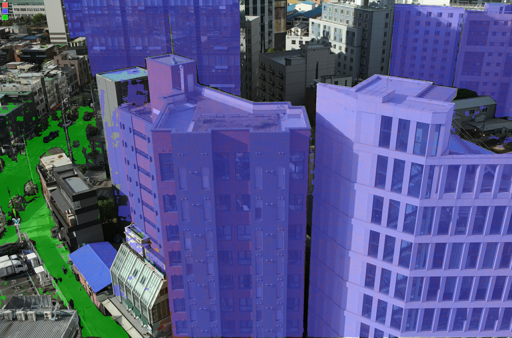
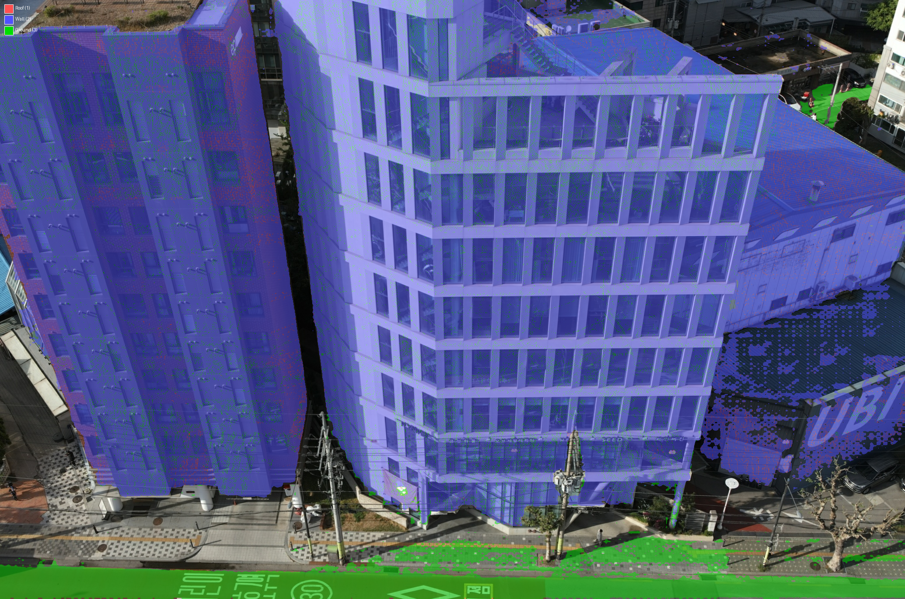

# Phase 2-A: 2D Segmentation 생성 결과 보고

## 수행 일시
2026-02-16

## 수행 작업 요약
Grounded SAM 2 (Grounding DINO + SAM 2.1)를 사용하여 드론 항공 이미지에서 roof/wall/ground semantic segmentation map을 생성했다. **MVS Hybrid 접근법** 적용: Grounded SAM으로 building/ground 영역을 검출한 후, COLMAP MVS normal map으로 building 영역을 roof(수평면)/wall(비수평면)으로 분할한다.

### 구현 내용
- `scripts/generate_segmentation.py` 생성
- Dockerfile에 `transformers>=4.45.0,<5.0.0`, `supervision`, `pycocotools` 추가
- 모델: Grounding DINO Tiny + SAM 2.1 Hiera Large (HuggingFace Transformers)
- **MVS Hybrid 모드** (최종): Grounded SAM (building+ground 검출) → COLMAP MVS normal로 building→roof/wall 분할
- **Text-only 모드**: Normal 없는 이미지용 fallback

### Normal source 선택: MVS vs Metric3D

Metric3D normal 대신 COLMAP MVS normal을 사용한 이유:

| | Metric3D Normal | COLMAP MVS Normal |
|---|---|---|
| 성격 | 단안 신경망 추정 | Multi-view 삼각측량 기반 |
| Facade 오분류 | **83.6%가 roof로 오분류** | **20.2%만 roof (정확)** |
| 도로 정확도 | 72.9% | **91.4%** |
| Facade/Road 구분 | mean 0.587 vs 0.621 (구분 불가) | **mean -0.240 vs +0.566 (확실히 구분)** |
| Coverage | 83.5% | 73.9% |

Metric3D는 비스듬한 드론 뷰에서 건물 외벽을 체계적으로 수평면으로 오추정 (foreshortening bias). MVS normal은 노이즈가 있지만 평균 방향이 기하학적으로 정확.

### Hybrid 전략
1. Grounded SAM으로 "building"과 "ground" 영역을 독립 검출
2. Building 영역 내에서 **COLMAP MVS normal**의 world UP 방향 내적값으로 분류:
   - dot(normal, world_up) > 0.5 → **roof** (수평면, 옥상)
   - dot(normal, world_up) ≤ 0.5 → **wall** (비수평면, 외벽/facade)
3. Building-Ground 중첩 영역: normal로 판단 (수평→ground, 비수평→wall)

### 클래스 매핑
| Class ID | 이름 | 검출 방법 | 색상 |
|----------|------|----------|------|
| 0 | background | — | 검정 |
| 1 | building roof | Grounded SAM "building" + MVS normal(수평) | 빨강 |
| 2 | building wall | Grounded SAM "building" + MVS normal(비수평) | 파랑 |
| 3 | ground | Grounded SAM "ground/road" | 초록 |

## 정량 지표

### 학습용 100장 Coverage (MVS Hybrid)
| 지표 | Mean | Min | Max | Median |
|------|------|-----|-----|--------|
| Coverage | 58.9% | 36.0% | 88.0% | 58.0% |
| Roof | 8.3% | — | — | — |
| Wall | 28.6% | — | — | — |
| Ground | 22.0% | — | — | — |
| ≥50% coverage | 79/100 | — | — | — |

### 3가지 접근법 비교 (학습 100장)
| 지표 | Text-only | Metric3D Hybrid | **MVS Hybrid** |
|------|-----------|-----------------|----------------|
| Roof | 15.7% | 17.2% | **8.3%** |
| Wall | 23.2% | 17.7% | **28.6%** |
| Ground | 18.9% | 23.9% | 22.0% |
| Facade→Roof 오분류 | 높음 (text 혼동) | **매우 높음** (normal bias) | **낮음** (기하학적 정확) |

### 전체 180장 Coverage
| 지표 | Mean | Min | Max |
|------|------|-----|-----|
| Coverage | 52.2% | 12.4% | 88.0% |
| Roof | 6.9% | 0.0% | 37.3% |
| Wall | 25.0% | 0.0% | 67.4% |
| Ground | 20.3% | 1.2% | 49.5% |
| 모드 | 100 MVS hybrid / 80 text-only | — | — |

## 정성적 결과

### 샘플 1: 건물 facade 뷰 (0621)

- 건물 외벽 전체 → wall(파랑): **정확** (Metric3D에서는 상부가 roof로 오분류)
- 도로 → ground(초록): 정확
- Coverage 87.5%, Wall 54.8%

### 샘플 2: 건물 facade 근접 뷰 (0624)

- 건물 외벽 → wall(파랑): 정확
- 하단 도로 → ground(초록): 정확
- Coverage 76.6%, Wall 47.9%

### 샘플 3: 고밀도 도심 뷰 (0692)

- 다수 건물의 외벽 → wall(파랑): 유리 건물, 벽돌 건물 모두 정확
- 거리 → ground(초록): 정확
- Coverage 65.9%, Wall 58.3%

### 샘플 4: 건물 군집 뷰 (0697)

- 고층 건물 외벽 → wall(파랑): 여러 건물에서 일관됨
- 도로/공원 → ground(초록): 좌하단 정확
- Coverage 69.9%, Wall 62.6%

### 샘플 5: 이전 문제 사례 — 수정됨 (0700)

- **Metric3D에서는 facade가 ground(초록)으로 오분류**되던 이미지
- MVS normal로 전환 후 → 건물 전체가 wall(파랑)으로 **정확히 분류**
- Coverage 73.8%, Wall 63.2%

## Go/No-Go 판단
- [x] Go (시각적 분류 품질 양호, facade→wall 분류 정확)
- [ ] 조건부 Go
- [ ] Retry

### 근거
1. **건물 facade 분류 정확**: 0621, 0624, 0692, 0697, 0700에서 외벽이 wall로 정확히 분류
2. **Metric3D 대비 개선**: facade→roof 체계적 오분류 문제 해결
3. **도로/ground 분류 양호**: MVS normal의 도로 91.4% 정확도 (Metric3D 72.9%)
4. **Coverage 58.9%** (학습셋): 미분류 영역은 `ignore_index=0`으로 학습에서 제외
5. **알려진 한계는 L_mutual로 해결 가능**: MVS 노이즈에 의한 pixel-level speckle은 Phase 3에서 정제 기대

### 알려진 한계
| 한계 | 원인 | 개선 방향 |
|------|------|----------|
| MVS 노이즈 speckle | MVS normal의 pixel-level 노이즈 | L_mutual 정제 또는 median filter |
| Roof 비율 낮음 (8.3%) | 비스듬한 뷰에서 옥상 가시성 제한 + 중첩 영역 overlap→ground | 허용 가능 (드론 뷰 특성) |
| Text-only 이미지 (80장) 낮은 품질 | MVS normal 없이는 roof/wall 구분 불가 | 학습 100장은 모두 MVS hybrid |
| MVS coverage 74% | 일부 building 픽셀 normal 없음 → wall(기본값) | 대부분 정확한 기본값 |

## 출력 파일
- `user_inputs/testset/0_25x/seg_maps/` — 180장 class index PNG (0-3)
- `user_inputs/testset/0_25x/seg_vis/` — 180장 오버레이 시각화
- `scripts/generate_segmentation.py` — 생성 스크립트 (MVS hybrid + text-only 지원)

## 이슈 및 해결
1. **transformers 5.x 호환성**: PyTorch 2.3.1에서 transformers 5.x는 PyTorch 2.4+ 요구 → `transformers>=4.45.0,<5.0.0`으로 제한
2. **SAM 2 post_process_masks 오류**: 내부 텐서 크기 불일치 → F.interpolate로 수동 업스케일 구현
3. **Metric3D normal bias**: 비스듬한 드론 뷰에서 facade를 수평면으로 오추정 → COLMAP MVS normal로 전환하여 해결
4. **Normal 부호 규약**: Metric3D와 COLMAP MVS 모두 dot product 부호 반전 필요 (경험적 확인)

## 다음 Phase
Phase 2-B: 의미론적 헤드 구현 (f_i 추가, semantic 렌더링, L_sem 구현)
- 위 seg_maps를 GT supervision으로 사용
- `ignore_index=0`으로 미분류 영역 제외
- L_mutual (Phase 3)에서 noisy label 정제 기대
