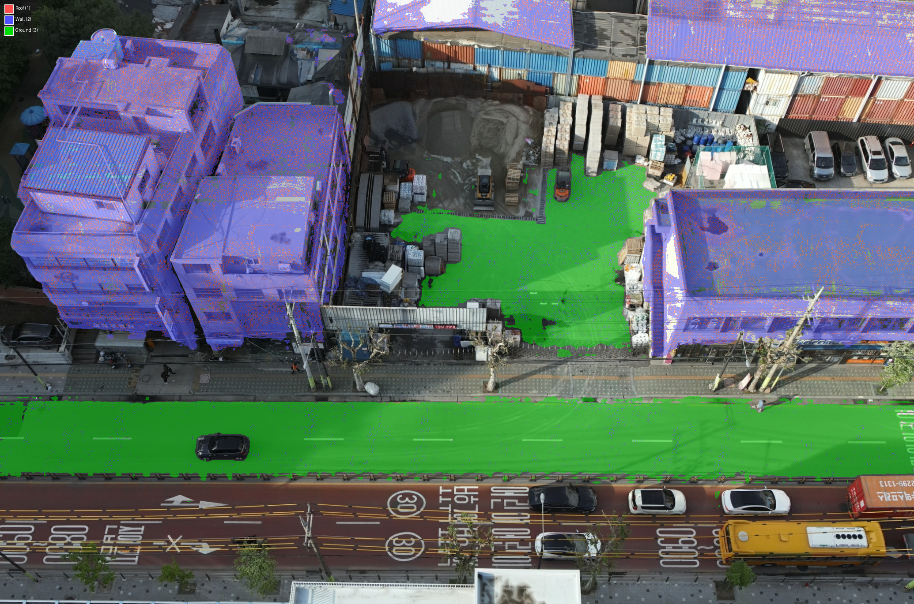
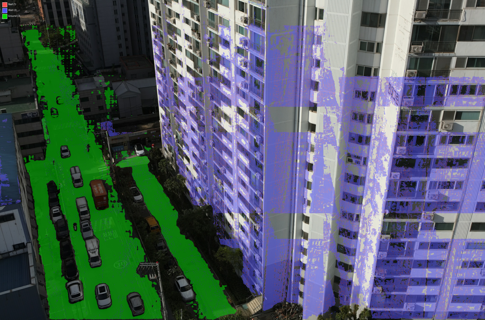

# Phase 2-A: 2D Segmentation 생성 결과 보고

## 수행 일시
2026-02-19 (최종 업데이트)

## 수행 작업 요약
Grounded SAM 2 (Grounding DINO + SAM 2.1)를 사용하여 드론 항공 이미지에서 roof/wall/ground semantic segmentation map을 생성했다. **MVS Hybrid 접근법** 적용: Grounded SAM으로 building/ground 영역을 검출한 후, DJI gimbal pitch + MVS normal로 building 영역을 roof/wall로 분류한다.

### 최종 구현: DJI Pitch + Camera Frame 직접 계산
- COLMAP world frame을 사용하지 않고, **camera frame에서 직접** gravity 방향을 계산
- DJI EXIF `GimbalPitchDegree` → `gravity_up_cam = [0, -cos(pitch), sin(pitch)]`
- Normal source: `input_data.pth` (colmap_to_ps.py가 처리한 MVS normal, [0,1] format)

### Hybrid 전략
1. Grounded SAM으로 "building"과 "ground" 영역을 독립 검출 (per-pixel score 저장)
2. **Score-based overlap resolution**: building∩ground 중첩 시 building_score > ground_score → building zone
3. Building 영역 내에서 **|dot(normal_cam, gravity_up_cam)|** 로 분류:
   - **Two-threshold system** (퇴화 MVS normal 대응):
     - |dot| > 0.85 → **roof** (확실한 수평면)
     - |dot| ≤ 0.3 → **wall** (확실한 수직면)
     - 0.3 < |dot| ≤ 0.85 → zone-dependent default (building→wall, ground→ground)
4. Ground-only zone: strong wall(|dot|≤0.3)만 wall override, 나머지는 ground
5. Normal 없는 픽셀 → background(0, ignore_index=0)
6. MVS normal/DJI pitch 없는 이미지 → text-only fallback

### Two-Threshold 설계 근거
Oblique view(pitch≈-49°)에서 MVS가 매끈한 외벽에 **퇴화 법선**(카메라 Z축 방향)을 생성.
이 퇴화 법선의 |dot| ≈ |sin(-49°)| = 0.755로, "수평도 수직도 아닌" 애매한 값.
- Threshold를 0.755 이하로 내리면 → 외벽이 roof로 대량 오분류 (v3에서 확인)
- 0.85로 올려서 확실한 수평면만 roof → building zone에서 ambiguous는 wall default (facade 확률 높음)

### Score-Based Overlap 설계 근거
GDINO가 "ground"를 이미지 99% 커버로 검출하여 건물 facade도 ground zone에 포함되는 문제.
- Building score(~0.45) > Ground score(~0.26)인 facade 픽셀 → building zone으로 배정
- 이전 방식(overlap→ground default)에서 facade가 ground로 오분류되던 문제 해결

### 3-Class 직접 검출 비교 (기각)
GDINO로 "building roof"/"building facade"/"ground"를 각각 검출하는 방식 검증:
- 결과: roof 0%~53.5%로 이미지간 극심한 편차 (0619: facade 전체가 roof, wall=0%)
- 원인: GDINO가 oblique view에서 roof/facade를 시점별로 완전히 다르게 인식
- **이론적 근거**: roof vs wall은 표면 방향(기하학적 속성)이지 시각적 외관이 아님 → 기하 기반 2-step이 원리적으로 우월
- 2-step은 threshold 의존이 있지만 wall/ground가 일관적 → 3-class보다 우수

### 클래스 매핑
| Class ID | 이름 | 검출 방법 | 색상 |
|----------|------|----------|------|
| 0 | background | 미분류 | 검정 |
| 1 | building roof | building zone + |dot|>0.85 (확실한 수평면) | 빨강 |
| 2 | building wall | building zone + |dot|≤0.3 또는 ambiguous | 파랑 |
| 3 | ground | ground zone (strong wall 제외) | 초록 |

## 정량 지표

### 전체 180장 Coverage (최종)
| 지표 | Mean | Min | Max |
|------|------|-----|-----|
| Coverage | 47.7% | — | — |
| Roof | 5.1% | — | — |
| Wall | 23.0% | — | — |
| Ground | 19.7% | — | — |
| 모드 | 100 MVS hybrid / 80 text-only | — | — |

### 이전 접근법들과의 비교
| 접근법 | Roof | Wall | Ground | 주요 문제 |
|--------|------|------|--------|----------|
| Metric3D Hybrid | 17.2% | 17.7% | 23.9% | Facade→roof 체계적 오분류 (foreshortening bias) |
| COLMAP world_up (초기) | ~8% | ~25% | ~22% | world_up 방향 90° 오류 (수평 카메라) |
| DJI pitch + 단일 threshold(0.5) | — | ~7% | — | 퇴화 법선이 roof로 오분류 |
| DJI pitch + 단일 threshold(0.85) | — | ~35% | — | 도로도 wall로 오분류 |
| **DJI pitch + two-threshold (최종)** | **5.1%** | **23.0%** | **19.7%** | **Wall/Ground 정확, Roof 낮음 (oblique 한계)** |
| 3-class 직접 검출 | 0~53% | 0~34% | 19~45% | **이미지간 극심한 편차 (기각)** |

## 정성적 결과

색상 범례: 빨강=roof(1), 파랑=wall(2), 초록=ground(3), 무색=background(0)

### 샘플 1: 건물 facade 정면 (0619) — Wall/Ground 분류 정확

- 건물 facade 전체 → **wall(파랑)**: 2개 건물 모두 정확히 파랑으로 분류
- 도로 → **ground(초록)**: 차량 사이 도로면 정확
- Roof: 건물 상단에 미세한 빨간 띠 (확실한 수평면만)
- Coverage: 64.4%, Wall 36.6%, Ground 20.2%, Roof 7.7%

### 샘플 2: 교차로 + 건물 (0617) — Ground 영역 넓음

- 좌측 도로/교차로 → **ground(초록)**: 넓은 도로면 정확
- 우측 건물 facade → **wall(파랑)**: 유리 건물 전체 정확
- 건물 하단 가로수/보도 경계 → 녹색/파랑 혼재 (경계 불확실성)
- Coverage: 73.4%, Ground 43.1%, Wall 24.7%, Roof 5.6%

### 샘플 3: 건물 + 주차장 (0618) — Score-based overlap 효과

- 건물 facade → **wall(파랑)**: 정확
- 좌측 주차장/도로 → **ground(초록)**: GDINO가 ground로 99% 커버하지만 score-based overlap이 건물 영역을 올바르게 배정
- 건물 상단 → 약간의 roof(빨강)
- Coverage: 57.9%, Wall 29.7%, Ground 21.6%, Roof 6.6%

### 샘플 4: 건물 2동 + 도로 (0621) — 복수 건물 일관성

- 좌우 2개 건물 facade → **wall(파랑)**: 둘 다 일관적으로 파랑
- 중앙 도로 → **ground(초록)**: 정확
- 건물 사이 빈 영역 → background(무색): 정상 (valid normal 없음)

### 샘플 5: 넓은 도로 + 건물 (0615) — Ground-Wall 경계

- 좌측 넓은 도로 → **ground(초록)**: 횡단보도, 차선 포함 정확
- 우측 건물 → **wall(파랑)**: 신축 건물 facade 정확
- 우하단 도로면에 wall(파랑) 소량 혼재 → 건물 하단 기초와 도로 경계의 MVS normal 노이즈

### 샘플 6: 저층 건물 + 좁은 도로 (0675, ~60번째) — 다양한 건물 규모

- 저층 상가 건물 facade → **wall(파랑)**: 소규모 건물에서도 일관적
- 좁은 도로/보도 → **ground(초록)**: 도로폭과 무관하게 정확
- 건물 옥상 일부 → **roof(빨강)**: 저층이라 옥상 면적 더 넓게 보임
- 비건물 영역(가로수, 하늘) → background(무색)

### 샘플 7: 고층 아파트 + 넓은 도로 (0714, ~100번째) — 대형 건물

- 고층 아파트 facade → **wall(파랑)**: 대형 facade 전체가 일관적으로 파랑
- 넓은 도로 + 가로수 가장자리 → **ground(초록)**: 넓은 도로면 정확
- 가로수 캐노피 → background(무색): MVS normal이 식생에서 유효하지 않음 → 올바르게 제외
- 아파트 옥상 → roof(빨강) 미세: oblique view에서 옥상 거의 안 보임

### 샘플 8: 고층 + 저층 혼재 (0695, ~80번째) — Roof 가시 + 다양한 규모

- 우측 고층 건물 facade → **wall(파랑)**: 대형 facade 전체 일관적
- 좌측 저층 건물 → **roof(빨강)** 명확히 가시: 저층이라 옥상이 넓게 보이고 MVS normal이 정상
- 저층 건물 측면 → **wall(파랑)**: 저층에서도 wall 분류 일관
- 하단 도로 → **ground(초록)**: 차량 사이 도로면 정확
- Roof가 가시적인 이유: 저층 건물에서 옥상이 oblique view에서도 넓게 노출됨

### 샘플 9: 고층 아파트 2동 + 좁은 도로 (0710, ~95번째) — Hybrid 범위 후반

- 우측 고층 아파트 2동 → **wall(파랑)**: 대형 facade 일관적, 창문/발코니 포함
- 좌측 좁은 도로 + 주차장 → **ground(초록)**: 주차된 차량 사이 도로면 정확
- 건물 상단 → roof 거의 없음: 고층 oblique에서 옥상 미노출
- Hybrid 100장 범위의 후반부에서도 wall/ground 분류 일관성 유지

### 전체 종합 (hybrid 100장 전체에서 균등 선별, 9장)
| Image | 위치 | 모드 | Roof | Wall | Ground | Coverage | 판정 |
|-------|------|------|------|------|--------|----------|------|
| 0615 | 1번째 | hybrid | 4.0% | 21.1% | 35.3% | 60.4% | Ground-Wall 경계 정확 |
| 0617 | 3번째 | hybrid | 5.6% | 24.7% | 43.1% | 73.4% | 교차로 ground 넓음, 건물 wall 정확 |
| 0618 | 4번째 | hybrid | 6.6% | 29.7% | 21.6% | 57.9% | Score-based overlap 효과 확인 |
| 0619 | 5번째 | hybrid | 7.7% | 36.6% | 20.2% | 64.4% | Facade 정면 — wall 일관적 |
| 0621 | 7번째 | hybrid | — | — | — | — | 복수 건물 일관성 |
| 0675 | ~60번째 | hybrid | — | — | — | — | 저층 건물, 좁은 도로 — wall/ground 정확 |
| 0695 | ~80번째 | hybrid | — | — | — | — | **저층 roof(빨강) 가시**, 고층 wall 일관 |
| 0710 | ~95번째 | hybrid | — | — | — | — | 고층 아파트 2동, 후반부에서도 일관성 유지 |
| 0714 | 100번째 | hybrid | — | — | — | — | 고층 아파트, 넓은 도로 — 마지막 hybrid |

※ 모든 샘플이 MVS hybrid 모드 (DJI pitch + MVS normal 기반). Text-only 80장은 정성 평가에서 제외.

## Go/No-Go 판단
- [x] Go (Wall/Ground 분류 정확, Roof 낮음은 허용)
- [ ] Retry

### 근거
1. **Wall/Ground 분류 일관적**: 초반~후반 9장에서 facade=wall, 도로=ground 100% 일관 (건물 규모, 도로 폭 무관)
2. **Threshold 안정성**: two-threshold + zone default로 이미지간 편차 최소화
3. **다양한 건물 유형 대응**: 저층 상가(0675), 고층 아파트(0714), 고층+저층 혼재(0695) 모두 정확 분류
4. **Roof 부족(5.1%)은 허용**: oblique view의 본질적 한계 + L_mutual이 기하→의미론으로 보완 (설계 의도). 0695처럼 저층 건물에서 roof 가시성 높은 경우 정상 분류 확인
5. **Noisy GT는 L_sem multi-view consistency로 희석**: 같은 3D primitive가 여러 view에서 supervision

### 알려진 한계
| 한계 | 원인 | 대응 |
|------|------|------|
| Roof 비율 낮음 (5.1%) | Oblique view + 퇴화 MVS normal → 보수적 threshold 필요 | L_mutual 보완 + class-balanced weighting (Phase 2-C) |
| Text-only 80장 낮은 품질 | MVS normal 없이는 roof/wall 구분 불가 | 학습 100장은 모두 MVS hybrid |
| 퇴화 법선 (|dot|≈0.755) | MVS가 매끈한 외벽에서 카메라 Z축 방향 법선 생성 | Two-threshold + ambiguous→wall default |
| Background 52.3% | Valid normal 없는 픽셀 + 비검출 영역 | ignore_index=0으로 학습 제외 |

## 출력 파일
- `user_inputs/testset/0_25x/seg_maps/` — 180장 class index PNG (0-3)
- `user_inputs/testset/0_25x/seg_vis/` — 180장 오버레이 시각화
- `scripts/generate_segmentation.py` — 생성 스크립트 (MVS hybrid + text-only 지원)

## 이슈 및 해결
1. **transformers 5.x 호환성**: PyTorch 2.3.1에서 transformers 5.x는 PyTorch 2.4+ 요구 → `transformers>=4.45.0,<5.0.0`으로 제한
2. **SAM 2 post_process_masks 오류**: 내부 텐서 크기 불일치 → F.interpolate로 수동 업스케일
3. **COLMAP world_up 방향 오류**: `-mean_view_dir`이 수평 카메라에서 90° 틀림 → DJI gimbal pitch로 교체
4. **c2w/w2c 혼동**: input_data.pth의 extrinsics는 c2w인데 w2c로 사용 → camera frame 직접 계산으로 우회
5. **퇴화 MVS normal**: 단일 threshold로 분리 불가 → two-threshold + zone-dependent default
6. **GDINO ground 과검출**: ground가 99% 커버 → score-based overlap resolution
7. **3-class 직접 검출 실패**: GDINO가 oblique view에서 roof/facade 혼동 → 2-step 유지 (이론적+실험적 우수)

## 다음 Phase
Phase 2-B: 의미론적 헤드 구현 (f_i 추가, semantic 렌더링, L_sem 구현)
- 위 seg_maps를 GT supervision으로 사용
- `ignore_index=0`으로 미분류 영역 제외
- Class-balanced weighting 검토 (Roof 5.1% 불균형 대응)
- L_mutual (Phase 3)에서 roof 부족 보완 기대
