# Phase 2-C: L_sem 독립 학습 결과 보고

## 수행 일시
2026-02-24

## 수행 작업 요약
Phase 2-B에서 구현한 의미론적 헤드(f_i parameter, L_sem, L_geo)를 사용하여 L_sem 독립 학습을 수행하였다.
이전 Phase 2-C(buggy MVS normal)와 달리, planar 읽기 버그 수정 후 MVS native normal로 통일된 input_data.pth를 사용하였다.

### 변경 사항 (이전 Phase 2-C 대비)
1. **Planar 읽기 버그 수정**: `read_colmap_array()`에서 COLMAP의 planar layout `(c,h,w)`을 interleaved `(h,w,c)`로 잘못 읽던 버그 수정
2. **MVS native normal 통일**: `colmap_to_ps.py --normal_source mvs`로 생성한 정식 input_data.pth 사용
3. **동일 seg_maps**: v10 (Confident Labels Only) 그대로 사용

### 학습 조건
| 항목 | 값 |
|------|-----|
| Config | `utils_demo/phase2c.conf` (demo.conf + enable_semantic=True) |
| Iterations | 5,000 |
| Initial planes | 3,000 |
| Views | 100 |
| Depth source | COLMAP MVS geometric depth |
| Normal source | COLMAP MVS native normal (planar 버그 수정) |
| Seg maps | v10 (Confident Labels Only, 48.8% coverage) |
| lambda_sem | 1.0 |
| lambda_geo | 0.1 |
| lr_semantic | 0.005 |

## 정량 지표

### Phase 비교

| 지표 | Phase 2-C (MVS native) | Phase 2-C (이전, buggy) | Phase 1 (cross-eval, MVS GT) | 변화 (vs 이전 2-C) |
|------|------------------------|------------------------|------------------------------|---------------------|
| Depth MAE | **0.0271 +/- 0.015** | 0.0488 +/- ? | 0.0245 (MVS test) | **-44.5%** |
| Normal cos | 0.7820 +/- 0.033 | 0.8399 +/- 0.014 | 0.7811 (MVS GT) | -6.9%* |
| mIoU | **0.8096 +/- 0.091** | 0.6154 +/- ? | — | **+31.6%** |
| Final planes | 2,615 | ? | 2,665 (MVS test) | |

*Normal cos 하락 주의: 이전 buggy 결과의 GT가 깨진 MVS normal이었으므로 직접 비교 불가.
MVS native GT 기준으로는 Phase 1 cross-eval(0.7811)과 사실상 동일(0.7820).

### Per-class IoU

| 클래스 | Phase 2-C (MVS native) | Phase 2-C (이전, buggy) | 변화 |
|--------|------------------------|------------------------|------|
| Roof | **0.6995** | 0.39 | **+79.4%** |
| Wall | **0.8354** | 0.66 | **+26.6%** |
| Ground | **0.8939** | 0.80 | **+11.7%** |

### 최종 학습 손실
| 손실 | 값 |
|------|-----|
| total | 0.576 |
| L_sem | 0.158 |
| L_depth | 0.015 |
| L_geo (normal consistency) | 1.926 |
| normal_cos | 0.144 |
| normal_l1 | 0.520 |

### Semantic 클래스 분포 (최종)
| 클래스 | 프리미티브 수 | 비율 |
|--------|-------------|------|
| Background | 16 | 0.6% |
| Roof | 306 | 11.6% |
| Wall | 1,328 | 50.4% |
| Ground | 984 | 37.3% |
| **Total** | **2,634** | 100% |

## 분석

### 핵심 발견

1. **Depth MAE 대폭 개선 (-44.5%)**: 0.0488 → 0.0271. 이전 buggy normal이 학습을 방해했음을 확인.
   정확한 MVS native normal supervision으로 depth reconstruction도 함께 개선되었다.

2. **mIoU 대폭 개선 (+31.6%)**: 0.6154 → 0.8096. 모든 클래스에서 IoU 향상.
   특히 Roof(0.39→0.70)가 가장 큰 폭으로 개선되었는데, 이는 정확한 normal supervision이
   표면 방향 추정을 개선하고 이것이 semantic 분류에도 간접적으로 기여했을 가능성을 시사한다.

3. **Normal cos 수치 하락은 착시**: 이전 0.8399는 buggy GT 대비 평가였으므로 무의미.
   현재 0.7820은 정확한 MVS native GT 대비이며, Phase 1 cross-eval의 0.7811과 동등하다.

4. **Normal cos의 Phase 1 비교에서 의미론적 헤드의 영향 없음**: Phase 1 MVS model(0.7811)과
   Phase 2-C(0.7820)가 거의 동일하여, L_sem 추가가 기하학적 품질에 영향을 주지 않음을 확인.
   이는 Phase 2-B에서 검증한 gradient 격리가 실제 학습에서도 작동함을 의미한다.

### Go/No-Go 판단
- [x] **Go**

| 기준 | 목표 | 결과 | 판정 |
|------|------|------|------|
| Depth MAE | Phase 1과 동등 | 0.0271 (Phase 1: 0.0245, +10.6%) | Go (유사 수준) |
| Normal cos | Phase 1과 동등 | 0.7820 (Phase 1: 0.7811, +0.1%) | Go |
| mIoU | ≥ 0.50 | **0.8096** | Go (크게 초과) |

Depth MAE가 Phase 1(0.0245)보다 약간 높지만(+10.6%), Phase 2-C에는 L_sem이 추가되어
L_geo가 경쟁하는 상황이므로 합리적인 trade-off이다. mIoU가 Go 기준을 크게 초과하므로 Phase 3-A 진행.

## 이슈 및 해결
1. **Planar 읽기 버그**: `read_colmap_array()`에서 COLMAP planar layout을 interleaved로 읽던 버그.
   `data.reshape(h,w,c)` → `data.reshape(c,h,w).transpose(1,2,0)` 수정.
   상세: `results/phase1_normal_comparison/REPORT.md` 참조.
2. **이전 Phase 2-C 결과 무효화**: buggy normal로 학습한 이전 결과(Depth MAE=0.049, mIoU=0.615)는
   참고값으로만 유지. 본 리포트의 결과가 정식 Phase 2-C 결과이다.

## 생성/수정 파일
- `scripts/colmap_to_ps.py` — planar 읽기 버그 수정, `--normal_source` 플래그
- `utils_demo/phase2c.conf` — Phase 2-C 학습 config (이전과 동일)
- `planarSplat_ExpRes/seongsu_phase2c_mvs/` — 실험 결과 디렉토리
- `planarSplat_ExpRes/seongsu_phase2c_mvs/eval_results.json` — 정량 평가 결과

## 정성적 결과

### Depth 렌더링 (GT vs Rendered)

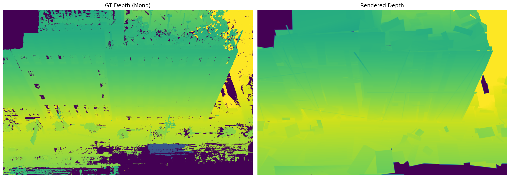
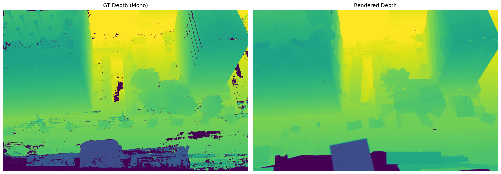
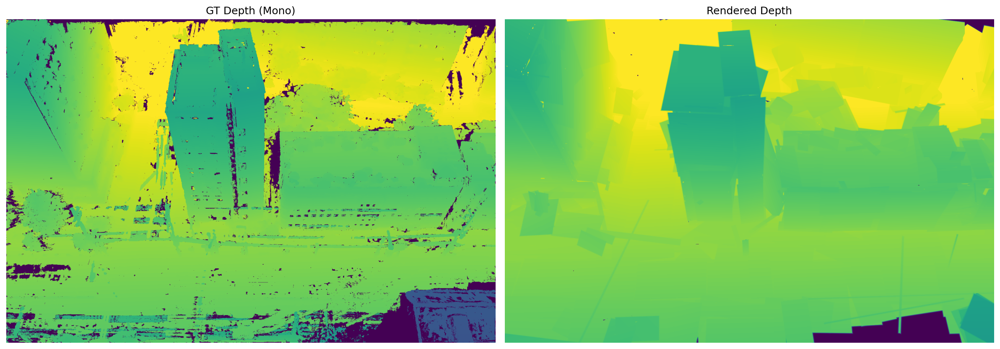
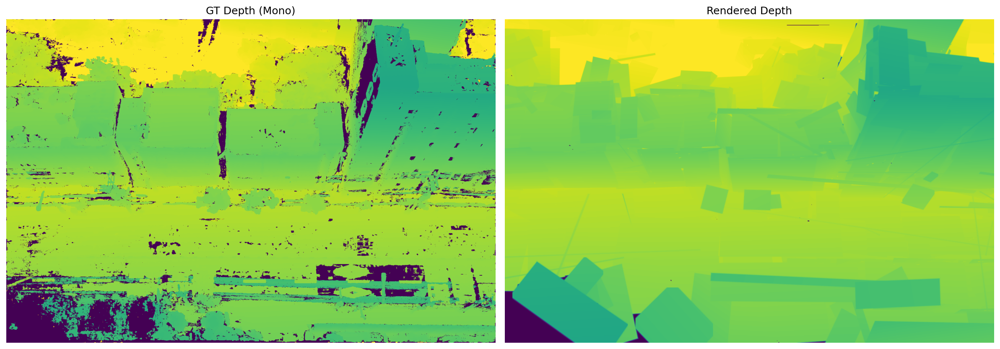

### Normal 렌더링 (GT vs Rendered)
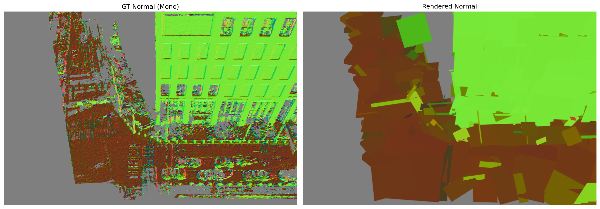
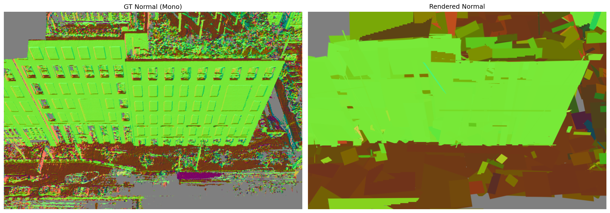
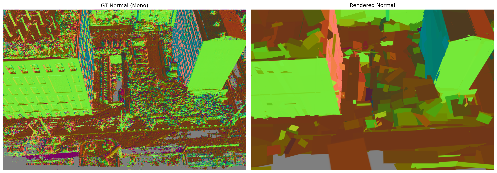
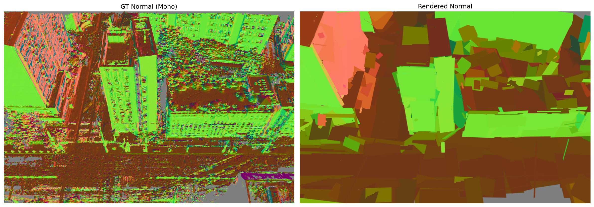
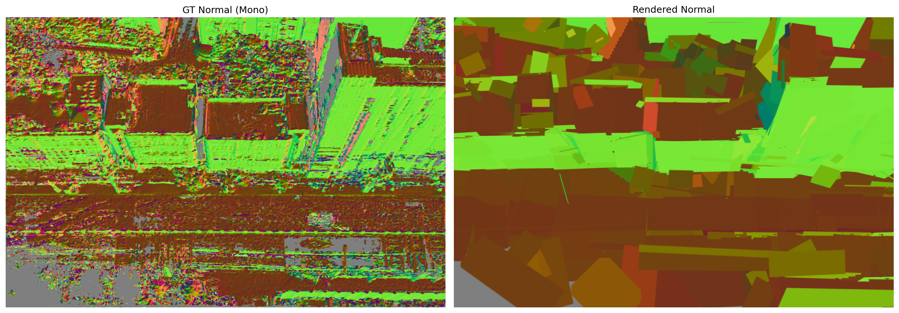

### RGB 참고

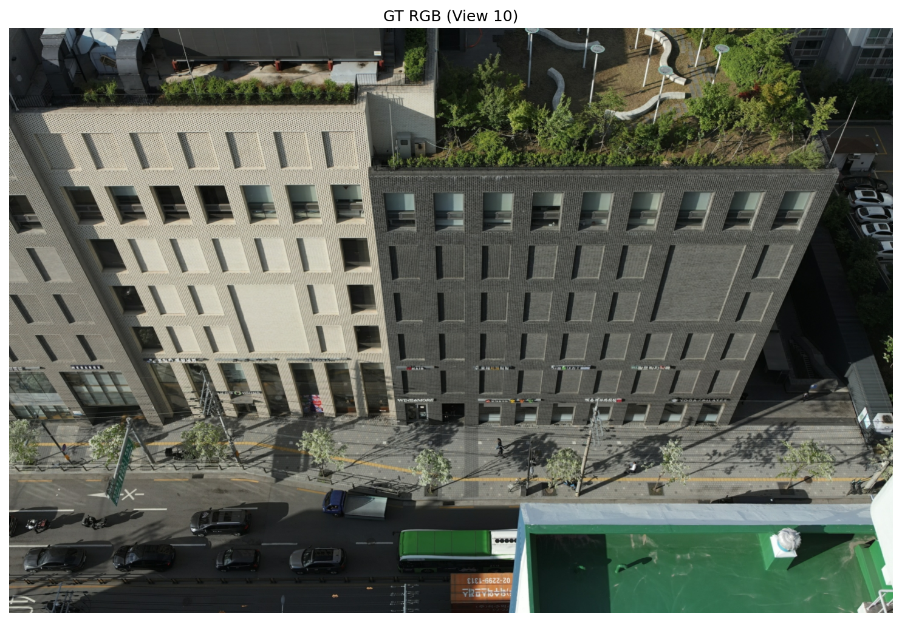
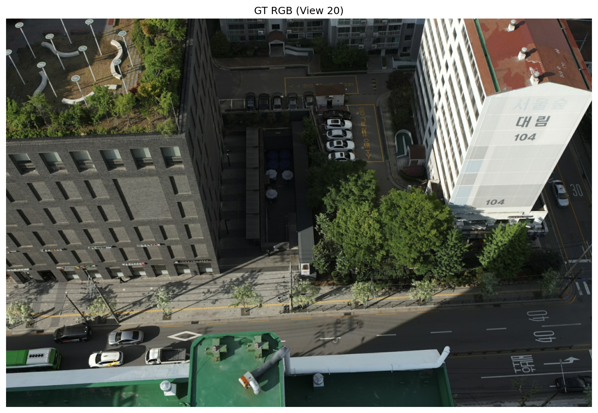
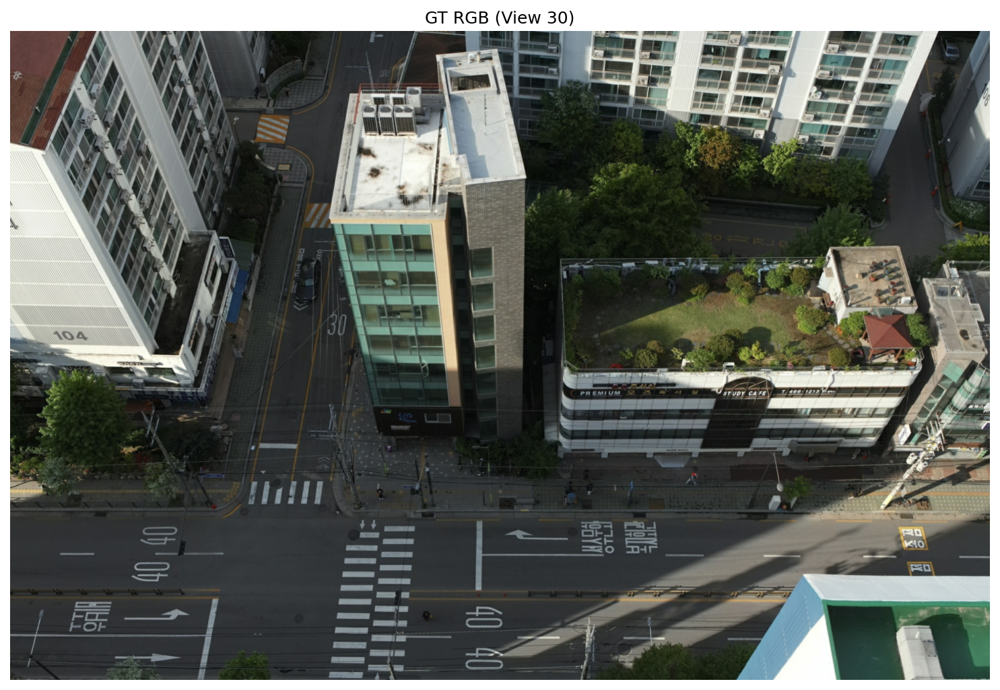

## 다음 Phase
- **Phase 3-A**: L_mutual 구현 (양방향 상호 보강 손실 함수)
