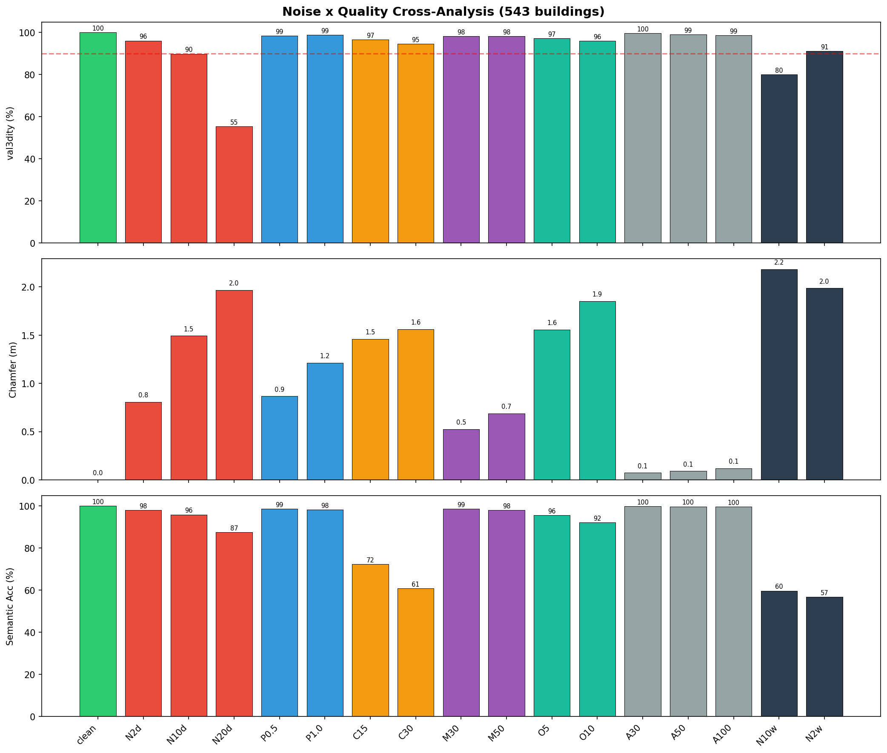
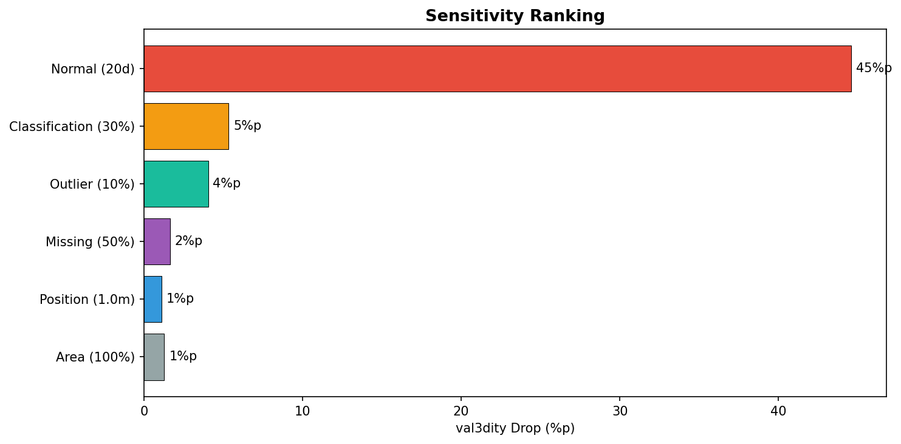
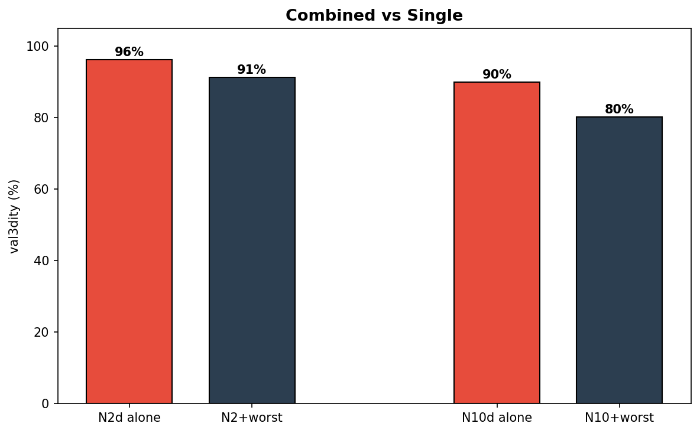
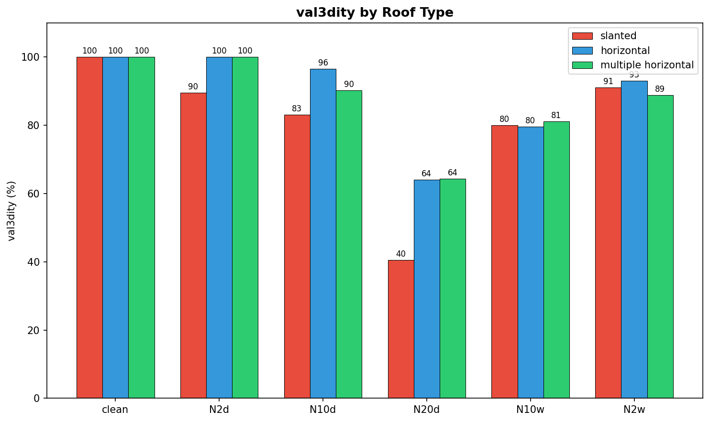
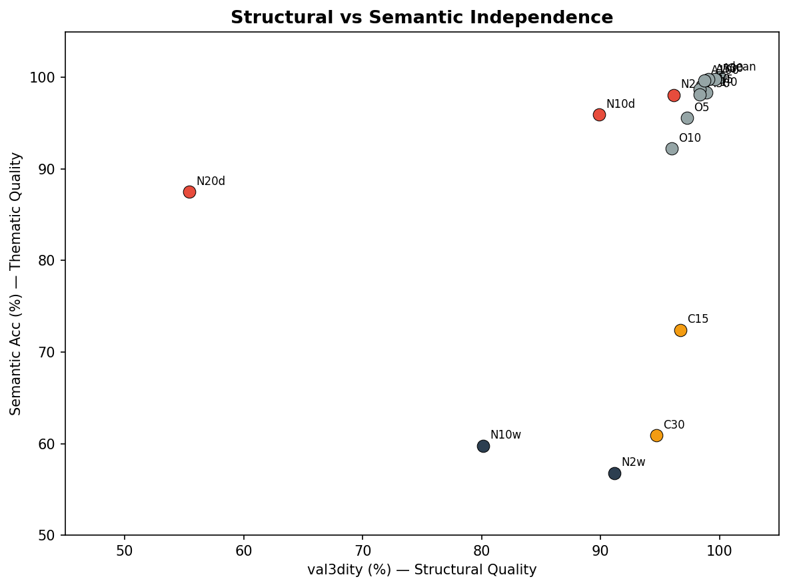

# Synthetic A: Stage 3 단독 검증 — 결과 보고

## 수행 일시
2026-03-27

## 목적

**질문: Stage 3 알고리즘이 어떤 유형/수준의 프리미티브 오류까지 유효한 CityGML LOD2를 생성할 수 있는가?**

이 결과로:
1. 각 프리미티브 속성의 **허용 범위** 확립
2. **가장 민감한 요인** 식별
3. 해당 요인이 **충분조건인지 필요조건인지** 판별
4. Stage 2의 최적화 목표를 수치로 설정

전체 실험 흐름에서의 위치: Synthetic A → (목표 설정) → Synthetic B → Real

## 핵심 결론

**법선 정확도가 CityGML 구조적 품질의 지배적 요인**이다. 법선 σ=10°에서 val3dity 90%, σ=20°에서 55%. 나머지 요인(위치, 분류, 누락, 아웃라이어, 면적)은 최대 노이즈에서도 val3dity 95%+ 유지.

**구조적 품질과 의미론적 정확성은 독립적**으로 결정된다. 법선은 구조적 품질에, 분류는 의미론적 정확성에 각각 영향. 이는 L_sem만으로는 구조적 품질을 개선할 수 없으며, 법선을 개선하는 별도 메커니즘(L_mutual)이 필요함을 뒷받침한다.

## 실험 설계

### 데이터

**3D BAG** (네덜란드 전국 LOD2 CityJSON, TU Delft). val3dity 검증된 GT.

선택 이유: CityJSON 형식 호환, val3dity 검증된 GT, 건물 유형 메타데이터 포함, 대규모(~1,000만 건물).

3개 scene (도시 유형별 다양성 확보):
- **Amsterdam Jordaan**: 역사적 canal house, 경사 지붕
- **Rotterdam Center**: 현대 상업 건물, 평지붕/대형
- **Delft Residential**: 주거 단지, row house

### 건물 필터링

| 단계 | Amsterdam | Rotterdam | Delft | 합계 |
|------|----------|----------|-------|------|
| Building 객체 | 2,956 | 1,020 | 4,914 | 8,890 |
| 파싱 통과 (area≥10m², faces≤200) | 2,890 | 943 | 3,515 | 7,348 |
| Stage 3 clean 성공 | ~2,600 (90%) | ~810 (86%) | ~3,440 (98%) | ~6,850 (~93%) |

Clean 실패 ~7%는 Stage 3 알고리즘의 한계 (극단적으로 좁은 건물, 복잡한 dormer/다단 지붕). 기존 CityGML 생성 방법(외부 footprint 제공, ~98%)과 비교하여, 외부 데이터 없이 프리미티브만으로 생성하는 trade-off.

### 샘플링

Roof type별 층화 추출 (543 건물):

| Roof type | Valid | 샘플 | 95% CI |
|-----------|------|------|--------|
| slanted | ~5,600 | 200 | ±5.0% |
| horizontal | ~1,000 | 200 | ±5.0% |
| multiple horizontal | ~210 | 143 (전부) | ±6.8% |

근거: 이항분포 정규근사, 유형별 200개이면 유형 간 차이를 식별 가능 (±5.0%).

### 실험 논리

```
1. Clean → baseline (100%)

2. 단일 요인 (14개)
   → 각 프리미티브 속성별 노이즈 → 모든 품질 지표 교차 측정
   → "어떤 요인이 가장 민감한가?" 식별

3. 복합 (2개)
   → 가장 민감한 요인의 임계 수준을 고정, 나머지 전부 최악
   → "해당 요인만 관리하면 충분한가?"
```

### 노이즈 조건 (17개)

| 구분 | 조건 | 구체적 내용 |
|------|------|-----------|
| baseline | clean | 노이즈 없음 |
| 법선 | normal_2°/10°/20° | 접선 평면 등방 회전 |
| 위치 | pos_iso_0.5m/1.0m | center XYZ σ Gaussian |
| 분류 | cls_15%/30% | class 랜덤 교체 |
| 누락 | missing_30%/50% | 프리미티브 랜덤 제거 |
| 아웃라이어 | outlier_5%/10% | 법선/위치 극단 변경 |
| 면적 | area_30%/50%/100% | area log-normal 스케일 |
| 복합 | N10_worst | N10°+P1.0+C30+M50+O10+A100 |
| 복합 | N2_worst | N2°+P1.0+C30+M50+O10+A100 |

### 평가 지표 (ISO 19157 기반)

| 품질 측면 | 지표 | 설명 |
|----------|------|------|
| 구조적 품질 | val3dity 통과율 | 기하학적 유효성 + 위상적 일관성 |
| 형상 정확도 | Chamfer distance | 양방향 평균 표면 거리 (GT=0m) |
| 의미론적 정확성 | Semantic accuracy | GT 면 매칭 후 라벨 일치율 |

## 결과

### 전체 결과 (543 건물, n=30)

| 조건 | val3dity | Chamfer (m) | Sem. Acc | 비고 |
|------|:---:|:---:|:---:|------|
| **clean** | **100%** | 0.00 | 1.00 | baseline |
| normal_2° | 96% | 0.81 | 0.98 | |
| **normal_10°** | **90%** | 1.49 | 0.96 | **Stage 2 목표 수준** |
| **normal_20°** | **55%** | 1.97 | 0.87 | 실패 수준 |
| pos_iso_0.5m | 99% | 0.87 | 0.99 | 영향 미미 |
| pos_iso_1.0m | 99% | 1.21 | 0.98 | 영향 미미 |
| cls_15% | 97% | 1.46 | **0.72** | val3dity 무관, sem만 |
| cls_30% | 95% | 1.56 | **0.61** | val3dity 무관, sem만 |
| missing_30% | 98% | 0.52 | 0.99 | 영향 미미 |
| missing_50% | 98% | 0.69 | 0.98 | 영향 미미 |
| outlier_5% | 97% | 1.56 | 0.96 | |
| outlier_10% | 96% | 1.85 | 0.92 | |
| area_30% | 100% | 0.07 | 1.00 | **영향 없음** |
| area_50% | 99% | 0.09 | 1.00 | **영향 없음** |
| area_100% | 99% | 0.12 | 1.00 | **영향 없음** |
| **N10_worst** | **80%** | 2.18 | 0.60 | 복합: N10° 단독(90%) 대비 -10%p |
| **N2_worst** | **91%** | 1.99 | 0.57 | 복합: N2° 단독(96%) 대비 -5%p |

### 분석 1: 법선이 지배적 요인

단일 요인 최대 수준에서의 val3dity 하락:

| 요인 (최대 수준) | val3dity 하락 |
|-----------------|:---:|
| **normal_20°** | **-45%p** |
| cls_30% | -5%p |
| outlier_10% | -4%p |
| missing_50% | -2%p |
| pos_1.0m | -1%p |
| area_100% | -1%p |

법선(-45%p)이 그 다음(분류, -5%p)보다 **9배 큰 영향**. 단일 요인에서 법선이 지배적.

복합 실험에서도 확인:
```
N2_worst (91%):  나머지 전부 최악 + 법선 2°  → clean 대비 -9%p
N10_worst (80%): 나머지 전부 최악 + 법선 10° → clean 대비 -20%p

차이: 법선만 2°→10° 변경 → -11%p 추가 하락
나머지 전부 최악의 기여: -9%p (N2_worst에서)

→ 복합에서도 법선 기여(11%p) ≥ 나머지 전부 합산(9%p)
```

### 분석 2: 구조적 품질과 의미론적 정확성은 독립적

| 노이즈 | val3dity 변화 | Semantic Acc 변화 | 영향 측면 |
|--------|:---:|:---:|------|
| 법선 20° | **-45%p** | -13%p | **주로 구조적** |
| 분류 30% | -5%p | **-39%p** | **주로 의미론적** |
| 위치 1.0m | -1%p | -2%p | 거의 무관 |

법선은 구조적 품질(val3dity)에, 분류는 의미론적 정확성(Sem. Acc)에 각각 **독립적으로** 영향.

**시사점**: L_sem(분류 감독)만으로는 구조적 품질을 개선할 수 없다. 분류를 완벽하게 해도 법선이 틀리면 CityGML이 실패한다. 법선을 개선하는 별도 메커니즘(L_mutual)이 필요하다. → **설계 선택 2(L_mutual)의 필요성을 뒷받침.**

### 분석 3: 법선은 지배적 조건이지만 엄밀한 충분조건은 아님

```
normal_10° 단독: 90%
N10_worst:       80% (-10%p)
```

법선 10°에서 나머지가 전부 최악이면 10%p 추가 하락. 다만:
- 이 10%p는 **6개 요인이 전부 최대 수준일 때**의 합산 효과
- 실제 Stage 2에서 모든 요인이 동시에 최악일 가능성은 낮음
- Stage 2가 법선 10°를 달성하면서 나머지도 극단적으로 나쁠 시나리오는 비현실적

→ **실용적으로는 법선 관리가 사실상 충분**. 엄밀한 충분조건은 아니지만, 추가 관리가 필요한 경우는 모든 요인이 동시 최악인 극단적 상황에 한정.

### 분석 4: 건물 유형별 법선 민감도 차이

| 조건 | slanted | horizontal | multiple |
|------|:---:|:---:|:---:|
| clean | 100% | 100% | 100% |
| normal_10° | **83%** | **96%** | 90% |
| normal_20° | **40%** | **64%** | 64% |
| N10_worst | 80% | 80% | 81% |
| N2_worst | 91% | 93% | 89% |

**Slanted roof가 법선에 가장 민감**하다 (10°에서 83%, horizontal은 96%). 이유: 경사 지붕은 ridge/eaves 계산에 roof 법선의 정확도가 필요. 평지붕(horizontal)은 단순 extrusion이라 법선 오차에 더 강건.

**시사점**: Stage 2에서 **slanted roof 건물의 법선 정확도**가 특히 중요. L_mutual의 L_slope(경사 roof가 수평이면 penalty)이 이를 지원.

### 분석 5: 면적 오차는 영향 없음

area_100% (면적 2배 오차)에서도 val3dity 99%, Chamfer 0.12m, Sem 1.00. Plane equation의 가중 평균에서 면적 가중치가 틀려도, 충분한 수의 프리미티브가 있으면 plane equation이 유지됨. Stage 2의 `_plane_radii_xy_p/n` 정확도는 CityGML 품질에 영향 없음.

## Stage 2 반영 / 다음 단계

### Stage 2 최적화 목표

1. **최우선: Wall 법선 σ ≤ 10°** — CityGML val3dity 90% 달성의 핵심 조건. L_mutual의 L_vert가 이를 담당.
2. **중요: Gravity 추정 정확도** — 법선 정렬의 기준. 5° 오차 시 허용 범위의 절반 소모.
3. **분류 정확도** — Semantic Accuracy에만 영향. 현재 mIoU=0.81로 충분.
4. **여유 충분: 위치/누락/면적** — Stage 2에서 특별한 관리 불필요.

### 다음 단계

1. **Synthetic B**: L_mutual이 법선 σ≤10°를 달성하여 CityGML 생성을 가능하게 하는가?
   - 출력 프리미티브의 법선 σ를 이 실험의 임계값과 대조
2. **Real**: ISPRS + 성수동에서 전체 파이프라인 + City3D 비교

## 알려진 한계

1. **Clean 완전성 ~93%**: 극단 좁은 건물, 복잡 dormer 등에서 Stage 3 실패. 외부 footprint 없는 자동 생성의 trade-off.
2. **3D BAG roof type**: slanted/horizontal/multiple 3가지만 구분. Gable vs hip vs shed 세부 구분 없음.
3. **Chamfer baseline**: clean에서 0.00m (동일 GT 사용). 절대값보다 조건 간 상대 변화가 의미 있음.
4. **복합 실험의 요인 분해**: N10_worst에서 각 요인의 개별 기여도를 정밀 분해하려면 요인 제거 실험 추가 필요.

## 시각적 산출물

- `results/stage3_synthetic_a/scene_amsterdam_jordaan_full.png`: Amsterdam 전체 뷰
- `results/stage3_synthetic_a/scene_rotterdam_center_full.png`: Rotterdam 전체 뷰
- `results/stage3_synthetic_a/scene_delft_wijk_full.png`: Delft 전체 뷰
- `results/stage3_synthetic_a/3dbag_buildings_3d_sample.png`: 건물 3D 샘플
- `results/stage3_synthetic_a/3dbag_results.json`: 전체 결과 데이터 (543×17)

### 노이즈 × 품질 교차 분석


### 민감도 순위


### 복합 vs 단일 비교


### 건물 유형별 비교


### 구조적 품질 vs 의미론적 정확성 독립성


## 생성/수정 파일

| 파일 | 유형 | 핵심 |
|------|------|------|
| `scripts/fetch_3dbag_tiles.py` | 신규 | 3D BAG 타일 다운로드 |
| `scripts/stage3_synthetic/buildings_3dbag.py` | 신규 | CityJSON → 건물 파싱 |
| `scripts/stage3_synthetic/run_3dbag_experiment.py` | 신규 | 실험 실행 스크립트 |
| `scripts/stage3_synthetic/primitives.py` | 수정 | `add_noise_area()` 추가 |
| `scripts/build_2_5d.py` | 수정 | convex hull fallback, make_valid, wall normal XZ 투영 |
